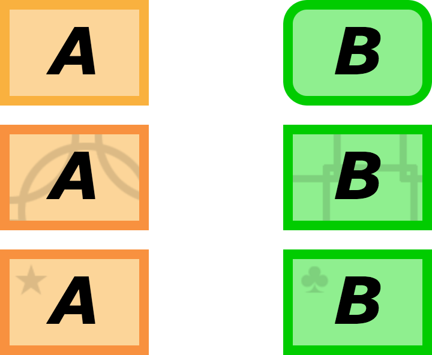

:doctitle:    Form design, 508 compliance, and new territory – Blog posts – VA-PALS – Projects – Staff – Vista Expertise Network

== Form design, 508 compliance, and new territory

This is the first significant web-based project in Vista∆∆1∆∆ (at least, that
I'm aware of), and that leaves us working in untouched snow, as it were:
there's a lot more pressure to do things right, because this work will probably
set up patterns that may last, for better or worse, for some time to come.

VA is a stickler for ``508 compliance,'' which mandates things like
closed-caption video or sign-language--accompanied audio to accommodate people
with hearing issues, websites that can be translated to Braille, and so on.

The Web, unfortunately, is still trying to establish good standards for some of
these things. It is also falling short on most of them. ``Radio buttons'' in
particular (a form of checkbox where only one can be checked at a time) are not
supported consistently, and can lead to strange and baffling results when put
through a text-to-speech processor.

Early on in this project, I was asked to mock up a quick form for testing---and
before long, it became The Thing That We're Going To Use. This is exactly the
sort of mistake we don't want to make---my mockup was never intended to be the
final form, it wasn't rigorous, and fixing it later winds up being extra work
that could have been avoided.

We do have certain constraints, however. Initially, we want to mirror the form
as published by the original I-ELCAP team to make for an easy transition, but
that doesn't make for a very flexible or accessible form. The field labels on
the original are not well-formed for these sorts of applications, there's a
strong reliance on radio buttons, and so on.

The present state of the art on web accessibility was last updated in 2008; the
https://www.w3.org/TR/WCAG20/[Web Content Accessibility Guidelines (WCAG)
2.0]. This lays out standards for graphical content, time-based media, and
reducing reliance on visual-only indicators, as well as making all
functionality available from the keyboard, and other such considerations.

One thing we are much more mindful of, for example, is accommodating
colorblindness, which affects around 8% of Americans. I checked with a
colorblind friend of mine (thanks, Ernest!), and these are nearly
indistinguishable to him.

There are several ways to make these differences clear for the colorblind:

Other such accommodations will need to be made for all the other listed classes
(primarily the blind, the deaf, those who are limited to keyboard or mouse
interfaces, etc.), and we'll work to keep those in mind going forward.

Of course, this means that some of the present form design (which is closely
labeled on the forms currently used by I{nbhy}ELCAP) will have to be
revisited. There's quite a database already, and we won't change the data
format lightly. But there are things we can do; for example, radio buttons that
indicate progression could be done with a more intuitive slider element that
would work more consistently across browsers. But even radio buttons and other
elements can be visually styled to reduce user error and the need for training.

One of the things that we're doing right now is establishing a ``form design
bible'' that lays out our various criteria for form layout. It includes notes
on how the form will display on tablets, in different orientations, and how it
will adapt to each of those. We'll also be making sure that contextual help is
readily available on every form; hopefully, the form will be intuitive enough
that there will be little need for it, but it will be there just in case.

We're excited to be part of this effort and helping to establish standards for
web-based Vista applications, as well as adding 508 compliance to our expertise
set.

'''

. We use ``VistA'' to refer to VA's version of the EHR software specifically,
  and ``Vista'' to refer to all projects closely based on that software. It
  bears noting that the actual name is an acronym (Veterans Information Systems
  and Technology Architecture), so VA's version should properly be called
  ``VISTA.''
