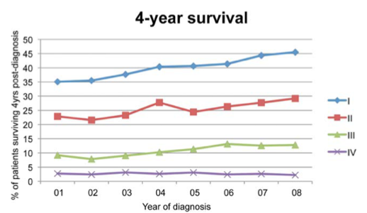
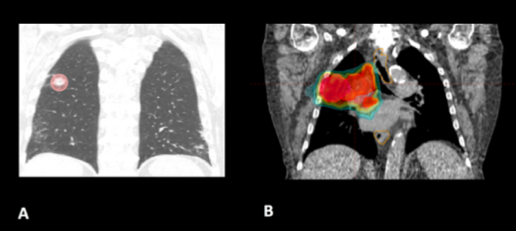
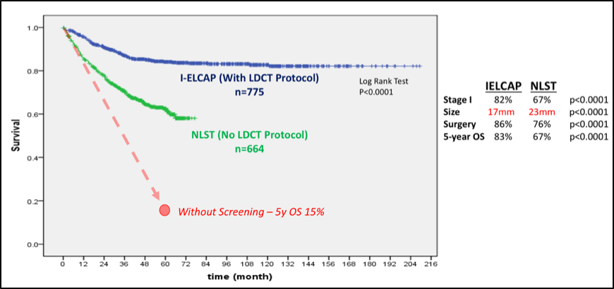
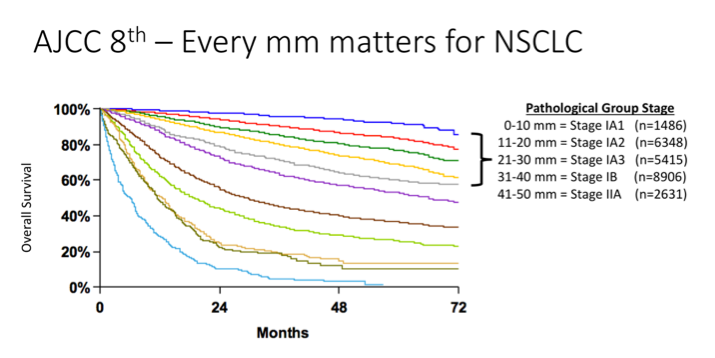
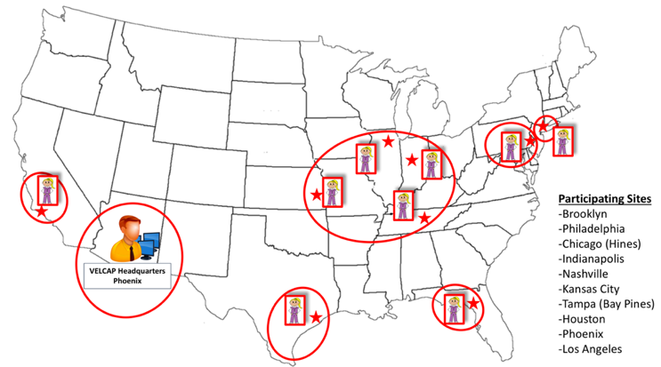
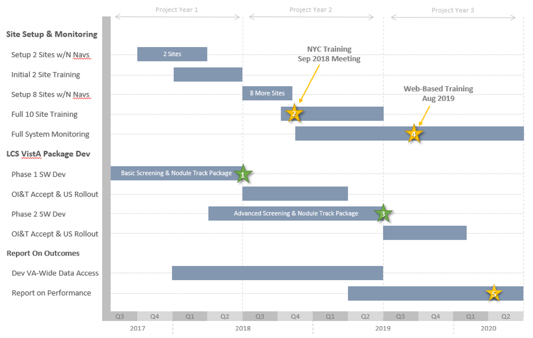
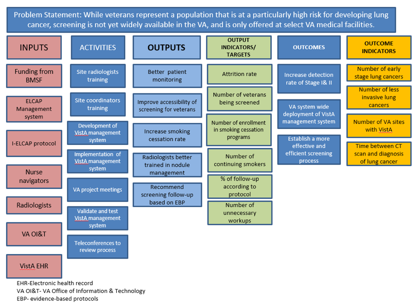

:doctitle:    PALS – Projects – Vista Expertise Network
:mastimg:     aboutvista
:mastcaption: Vista consultants
:mastdesc:    Real-time patient information means real care
:navlight:    vista
:mathjax:

== This document

Via Rick: ``Here's the final draft proposal for the VA-PALS project, the one
that won the grant award. Although the VA-PALS official start date is likely to
be 1{nbsp}July, I'd like to take advantage of the time ahead of that start date
to bring us all (including me) up to speed so we can hit the ground running. We
have a lot to learn, but the first step is obvious: assessing what we agree to
do for this grant money.''

The original file was a Word document named ††VA-PALS BMSF Proposal 2017.docx††
(link:bmsf-proposal-2017.docx[download]).

[red]##__Ed.__: Note that for some reason, email addresses are not working in
the table below.## I'm still trying to diagnose that. In the meantime, the
email addresses are (1){nbsp}mailto:Robert.Dresch@va.gov[],
(2){nbsp}mailto:drew.moghanaki@va.gov[],
(3){nbsp}mailto:rick.avila@accumetra.com[],
(4){nbsp}mailto:claudia.henschke@mountsinai.org[].

[red]##__Ed.__: Note also that most of this is just cut-and-pasted from the
original Word document.##

=== Contents

[options="compact"]
* Cover sheet
* <<narrative,Proposal Narrative>>
** <<sect-1,1. Organizational Mission>>
** <<sect-2,2. Statement of Need>>
** <<sect-3,3. Executive Summary>>
** <<sect-4,4. Target Population>>
** <<sect-5,5. Project Intervention and Implementation Plan: Goals, Activities and Timeline>>
** <<sect-6,6. Program Evaluation>>
** <<sect-7,7. Sustainability Plan>>
** <<sect-8,8. Results Dissemination Plan>>
** <<sect-9,9. Collaborating Partners>>
** <<sect-10,10. Other Funders>>
** <<sect-11,11. Detailed Budget>>
** <<sect-12,12. References>>
** <<sect-13,13. Appendices>>
** <<sect-14,14. Required Attachments>>

{nbsp}

'''

{nbsp}

[role="center"]
image::bmsf-bcc-logo.png[]

[cols="<.<0a,<.<1a",width="99%",frame="all",align="center",grid="none"]
|==============================================================================
|[nowrap]##**Date of submission:** (MMDDYYYY):## |4/13/2017
2+|**ORGANIZATION AND CONTACT INFORMATION:**
|[nowrap]##**Organization Name:**##
|McGuire Research Institute, Inc.
|[nowrap]##**Organization Website:**##
|http://www.navref.org/mcguire-research-institute/[]
|**Mailing Address:**
|VA Medical Center +
1201 Broad Rock Blvd +
Richmond, VA{quad}23249
|**Executive Director/CEO:**
|[nowrap]##Robert Dresch {quad}**E-mail:** mailto:Robert.Dresch@va.gov[]##
|[nowrap]##**Name & Title of Contract Signatory:**## +
(if different from ED)
|{zwj}[n/a]
|**Name & Title of Primary Contact Person for this project:**
|Drew Moghanaki, MD, MPH, Principal Investigator +
[nowrap]##**Phone:**{nbsp}804-675-5105##{quad}[nowrap]##**E-mail:** mailto:drew.moghanaki@va.gov[]##
2+|
2+|**PROJECT INFORMATION:**
|**Title:**
|Veterans Affairs---Early Lung Cancer Action Program (VA{nbhy}ELCAP)
|**Name and Title of Project Principal investigator:**
|Drew Moghanaki, MD, MPH, Director of Clinical Radiation Oncology Research,
Hunter Holmes McGuire VA Medical Center, Associate Professor, Virginia
Commonwealth University Department of Radiation Oncology +
[nowrap]##**Phone:**{nbsp}804-675-5105##{quad}[nowrap]##**E-mail:** mailto:drew.moghanaki@va.gov[]##
2+|**Name and title of Co-Principal Investigators:**
|**IT Co-PI:**
|Ricardo S. Avlia, MS +
[nowrap]##**Phone:**{nbsp}518-210-4194##{quad}[nowrap]##**E-mail:** mailto:rick.avila@accumetra.com[]##
|**Clinical Co-PI:**
|Claudia Henschke, MD, PhD +
[nowrap]##**Phone:**{nbsp}212-241-2821##{quad}[nowrap]##**E-mail:** mailto:claudia.henschke@mountsinai.org[]##
|**Is IRB approval required:**
|Yes ☒{quad}No ☐ +
**Estimated IRB Submission Date:** February 22, 2017 +
**Estimated Approval Date:** April 19, 2017
|Does your research protocol have a control arm?
|Yes ☒{quad}No ☐
|Registered nonprofit status:
|Yes ☒{quad}*No ☐
|Public entity:
|Yes ☒{quad}No ☐
2+|**FUNDING INFORMATION:**
|Total amount requested for this project:
|$5,828,550
|Total Project Budget:
|$5,828,550
|Period Covered by the Grant: (MM/YY -- MM/YY)
|7/1/17 -- 6/30/20
|==============================================================================

[[narrative]]
== Proposal Narrative

[[sect-1]]
=== 1. Organizational mission

The US Department of Veterans Affairs (VA) has been dedicated to improving the
care of patients with cancer for almost a century. This includes its commitment
to fund the first Tumor Research Laboratory at the Chicago Hines VA Hospital
in{nbsp}1932. It is notable that this scientific endeavor predated the
discovery of chemotherapy by more than a decade, and goes back to an era when
surgical techniques remained unsafe for many tumors.

Since that time, the VA has grown to become the nation’s largest integrated
healthcare system. It now provides a myriad of healthcare services for 9
million Veterans with a vast network of over 1,500 outpatient clinics to reach
all of its patients who live anywhere in the country. In addition, it continues
to dedicate resources to improve the outcomes of approximately 40,000 Veterans
who receive cancer care in the VA each year.footnoteref:["1","Zullig LL,
Jackson GL, Dorn RA, et{nbsp}al. Cancer incidence among patients of the
U.S. Veterans Affairs Health Care System. __Mil Med.__ 2012;177(6):693--701."]
This includes a focus on lung cancer since the 1960’s when the VA made a
significant early contribution to the literature regarding asymptomatic
solitary pulmonary nodules.footnoteref:["2","Steele JD. The Solitary Pulmonary
Nodule. Report of a Cooperative Study of Resected Asymptomatic Solitary
Pulmonary Nodules in Males. __J{nbsp}Thorac Cardiovasc Surg.__
1963;46:21--39."]

Today, the VA’s commitment to improving the outcomes for patients with lung
cancer is as strong as ever. This is exemplified by the following list of
recent high-level contributions to the field:

. A multi-site project funded by the VA Under Secretary of Health in 2012 to
evaluate the feasibility of a national lung cancer screening
program.footnoteref:["3","Kinsinger LS, Anderson C, Kim J, et{nbsp}al.
Implementation of Lung Cancer Screening in the Veterans Health Administration.
__JAMA Intern Med.__ 2017."]footnoteref:["4","Kinsinger{nbsp}LS, Atkins{nbsp}D,
Provenzale{nbsp}D, Anderson{nbsp}C, Petzel{nbsp}R. Implementation of a new
screening recommendation in health care: the Veterans Health Administration's
approach to lung cancer screening. __Ann Intern Med.__ 2014;161(8):597--598."]

. An evidence based review and recommendation, authored by VA investigators in
2013, to the United States Preventive Services Task Force (USPSTF) that in 2014
endorsed lung cancer screening as a preventive service to reduce the risk of
lung cancer mortality. This VA contribution ultimately led to the approval of
coverage for annual lung cancer screening by the Centers for Medicare &
Medicaid Services.footnoteref:["5","Humphrey{nbsp}LL, Deffebach{nbsp}M,
Pappas{nbsp}M, et{nbsp}al. Screening for lung cancer with low-dose computed
tomography: a systematic review to update the US Preventive services task force
recommendation. __Ann Intern Med.__ 2013;159(6):411--420."]

. A phase III randomized clinical trial funded in 2015 by the VA Cooperative
Studies Program to investigate the optimal treatment for early stage operable
lung cancer [https://clinicaltrials.gov/ct2/show/NCT02984761[VALOR:
NCT02984761]].

. A partnership announced in 2016 to create the Applied Proteogenomics
Organizational Learning and Outcomes consortium (APOLLO), in collaboration with
the Department of Defense and the National Cancer Institute, as part of the
wider National Cancer Moonshot
Initiative.footnoteref:["6",https://www.cancer.gov/research/key-initiatives/moonshot-cancer-initiative/milestones/nci-activities[].]

As these recent developments demonstrate, leaders and caregivers within the VA
are highly motivated and committed to further improving the quality of care for
Veterans with lung cancer.

[[sect-2]]
=== 2. Statement of Need

**Veterans represent a population that is at a particularly high risk for
developing lung cancer.** This is because millions of soldiers have served in
complex work environments that increased their rates of smoking and exposures
to carcinogenic chemicals. A recent query of the VA Cancer Cube demonstrates
that 77,930 Veterans were diagnosed with non-small cell lung cancer between
2006--2015 (VA{nbsp}Cancer Cube, accessed [nowrap]##January 15,
2017##). Unfortunately, the majority{nbsp}(58%) presented with advanced
[nowrap]##stage III--IV## disease, which as shown below is often incurable and
carries a [nowrap]##5-year## overall survival rate of only
2--13%.footnoteref:["7","Williams CD, Gajra A, Ganti AK, Kelley MJ. Use and
impact of adjuvant chemotherapy in patients with resected non-small cell lung
cancer. __Cancer.__ 2014;120(13):1939--1947."]

[[figure-1]]
[role="center"]
.**Survival rates goes down with stage.** The 4-year survival rate of Veterans diagnosed with stage I--IV lung cancer within the VA, by year of diagnosis (latexmath:[\(n = 48.844\)]).footnoteref:[7]

**When patients present with more advanced disease, their treatments aren’t
just less effective, they are also more toxic.** For example, when lung tumors
are detected latexmath:[\(<2\,\hbox{cm}\)], they can often be removed with a
limited sublobar resection instead of a lobectomy which is required for larger
tumors.footnoteref:["8","Wisnivesky JP, Henschke CI, Swanson{nbsp}S,
et{nbsp}al. Limited resection for the treatment of patients with stage{nbsp}IA
lung cancer. __Ann Surg.__ 2010;251(3):550--554"] They can alternatively be
treated with outpatient stereotactic radiotherapy, which offers a
[nowrap]##3-year## survival rate of over 90%.footnoteref:["9","Chang JY, Bezjak
A, Mornex F. Stereotactic ablative radiotherapy for centrally located early
stage non-small-cell lung cancer: what we have learned. __J{nbsp}Thorac
Oncol.__ 2015;10(4):577--585."] Yet, since lung cancer is initially
asymptomatic, patients who are not screened often have delayed access to care
and present with more advanced disease that has invaded or spread to other
organs. When this occurs, treatment options are not only less effective, but
also more toxic as they typically include systemic chemotherapy and/or
radiotherapy with treatment fields that are much larger (see
<<figure-2,Figure{nbsp}2>>).

[[figure-2]]
[role="center"]
.**The toxicity of radiotherapy treatments goes up with stage.** Radiotherapy treatment plans for a patient with [nowrap]##(A) stage I##, and [nowrap]##(B) stage III NSCLC##.

**A structured lung cancer screening program can save many lives, beyond the
20% reduction in mortality from lung cancer demonstrated in the landmark
National Lung Screening Trial (NLST).** It is widely believed that the
magnitude of mortality reduction with LCS is 20%.footnoteref:["10","National
Lung Screening Trial Research{nbsp}T, Aberle{nbsp}DR, Adams{nbsp}AM,
et{nbsp}al. Reduced lung-cancer mortality with low-dose computed tomographic
screening. __N{nbsp}Engl{nbsp}J{nbsp}Med__##. 2011;365(5):395--409."] However,
this is likely an underestimation of the magnitude of the potential the true
gains of LCS since that trial was limited to only 3 rounds of screening with 5
years of follow up. The full benefit of screening becomes manifest only when
screening continues over many rounds, which was not possible in the context of
a trial such as NLST.footnoteref:["11","Yankelevitz DF, Smith JP. Understanding
the core result of the National Lung Screening
Trial. __N{nbsp}Engl{nbsp}J{nbsp}Med.__## 2013;368(15):1460--1461."] It is
important to note that the NLST was not designed to measure the magnitude of
the benefit from continued screening, instead it was designed to test the
hypothesis of whether screening with CT led to a mortality reduction compared
with screening with chest radiography. Thus, it was successful to have met this
endpoint, but by no means should that success be thought of as an accurate
measurement of the true potential benefit.  Additional important factors that
reduce the mortality of lung cancer relate to critical elements in the clinical
workflow that were unavailable for patients randomized in the NLST study. These
include a structured protocol for managing abnormal findings, quality oversight
of LDCT interpretations, a dedicated navigator to ensure timely transition from
diagnosis to treatment, access to a thoracic oncology multidisciplinary team,
and continuous real-time feedback from a management system.  As shown in
<<figure-3,Figure{nbsp}3>> below, these elements, which are all a component of
the [nowrap]##I-ELCAP## protocol to be introduced into select VA facilities by
this project, can result in outcomes that are unmatched by that reported in the
NLST trial.footnoteref:["12","Yip R, Henschke CI, Yankelevitz DF, Boffetta P,
Smith{nbsp}JP, International Early Lung Cancer{nbsp}I. The impact of the
regimen of screening on lung cancer cure: a comparison of I{nbhy}ELCAP
and{nbsp}NLST. __Eur{nbsp}J Cancer Prev.__ 2015;24(3):201--208."]

[[figure-3]]
[role="center"]
.**Lung cancer screening program with a structured protocol is associated with further gains in survival than that demonstrated in the NLST.** This comparison of lung cancer specific survival between the patients diagnosed with stage I NSCLC in the I{nbhy}ELCAP and NSLT protocols reveals the potential magnitude of benefit when a structured LCS protocol is established to guide elements of LDCT acquisition, image interpretation, and a clinical management workflow that ensures the timely transfer of patients from diagnosis to treatment. LDCT: low dose computed tomography. (__Adapted from Yip, Henschke, Yankelevitz et{nbsp}al, 2015.__{hairsp})footnoteref:[12]

**Lung cancer screening programs can be complicated.** On face value, it
appears that offering LCS to all high-risk Veterans might be uniformly
beneficial.  However, it is widely recognized that there can be harms if a
large scale LCS program is poorly implemented.footnoteref:["13","de Koning HJ,
Meza R, Plevritis SK, et{nbsp}al. Benefits and harms of computed tomography
lung cancer screening strategies: a comparative modeling study for the
U.S. Preventive Services Task Force. __Ann Intern Med.__
2014;160(5):311--320."] Similar to the experience in breast cancer screening
with mammography, there are complex evidence-based clinical algorithms that
must be followed when interpreting images to avoid the risks of unnecessary
diagnostic procedures. A careful look at the NLST study, for example, reveals
that even in the context of a closely monitored clinical trial, there can be up
to a two-fold range in difference among radiological interpretations of LDCT
scans given the nuances of abnormal findings.footnoteref:["14","Gierada DS,
Pilgram TK, Ford M, et{nbsp}al. Lung cancer: interobserver agreement on
interpretation of pulmonary findings at low-dose CT screening. __Radiology.__
2008;246(1):265--272."] These challenges were also seen when the VA studied the
feasibility of a LCS program through an 8-site demonstration
project.footnoteref:["4"] With a limited budget, and tight study period between
2013--15, it sought to investigate the logistics of implementing a wide-scale
LCS program in the VA. It too found wide variability, notably demonstrating a
[nowrap]##3-fold## difference in abnormal finding between sites (31--85%); this
was more than double what is commonly reported in the literature. As the
authors of the report suggested, standardization of radiological
interpretations would have likely reduced this value, perhaps below 20%.

An additional source of variability that can complicate large scale LCS
programs regards how patients are approached and consented when recommended
screening LDCT scans. The VA demonstration project provided insights into these
sorts of challenges as well. The percent of Veterans who agreed to be screened
ranged between 37--65%, depending on the medical center that was making the
recommendation. This highlights the need to continuously improve the shared
decision making processes that are used to invite patients for screening,
particularly for those with poor health literacy who may misinterpret the risk
to benefit ratio. In fact, the process of shared decision in regard to
understanding the balance of benefit to risk ratio in screening can be quite
challenging. The approach commonly taken has been to present the mortality
result of NLST as representing the potential benefit.  However, this approach
is highly misleading as it does not reflect the true benefit that would occur
with continued rounds of screening. Nor does it consider the impact on an
individual and their family when considering that a lung cancer that would
otherwise be fatal within a few years could have actually been cured, if found
early.

**Structured informatics systems are essential to facilitate the complex
coordination of care needed to safely track abnormal findings in a LCS
program.** This was one of the major conclusions from the VA demonstration
project. The VA currently has several independently developed lung nodule
tracking systems running in different regions across the country to assist
clinicians who are engaged in{nbsp}LCS. As a testament to the will of its
clinicians to establish new LCS programs, manually operated systems in
the{nbsp}VA have been developed with local resources using homegrown Microsoft
Excel spreadsheets and Microsoft Access databases. Centralized engineering
centers within the{nbsp}VA have helped to map the data from these local systems
for data aggregation and reporting, a process which was used to report the
results of the{nbsp}VA{nbsp}LCS demonstration project.footnoteref:[3] Over
time, clinicians have eventually become accustomed to these systems, though all
users surveyed during the development of this proposal were encouraged by the
opportunity for improvements (personal communication). It was shared that each
of these solutions have their own shortcomings, and are considered to be
labor-intensive and cumbersome to use.

Meanwhile, a more important shortcoming that remains is that none of these
systems communicates directly with VA’s electronic health record system
(VistA). This lack of VistA integration misses the opportunity to automate many
of the manual processes to reduce the burden of increased clinical workflow. It
also misses an opportunity for information technology scalability, as each of
these management systems have been set up in parallel databases and as such are
not designed for this purpose. This latter issue underlies a fundamental
challenge for VA to develop a nationwide LCS program in the near future.

**The VA is unable right now to support a national LCS program.** Ultimately,
the final results of the VA demonstration project were recently published in
January{nbsp}2017, and revealed that the{nbsp}VA is not currently ready to
launch a wide scale LCS program at this time.footnoteref:[3] It concluded that
there was too much variability between{nbsp}VA facilities with the limited
resources available, and that the management of large cohorts of patients
undergoing screening can be difficult with the current tools available. As a
result, the{nbsp}VA remains without centralized program to support lung cancer
screening at all of its{nbsp}150 medical centers. A recent survey reported that
clinicians at almost all{nbsp}VA facilities are aware of the missed opportunity
to save lives with{nbsp}LCS, yet only 26% are ideally prepared to offer this
service at this time.footnoteref:["15","Tukey MH, Clark JA, Bolton R,
et{nbsp}al. Readiness for Implementation of Lung Cancer Screening. A National
Survey of Veterans Affairs Pulmonologists. __Ann Am Thorac Soc.__
2016;13(10):1794--1801."] A few{nbsp}VA facilities are offering their support
as resources may allow, but the vast majority of providers in the{nbsp}VA are
currently left to develop their own{nbsp}LCS program without structured
supervision or support.

**The proposed strategic partnership between BMSF and VA offers a tremendous
opportunity to fulfill an unmet need for thousands of Veterans at risk for lung
cancer.** That’s because the{nbsp}VA has numerous resources and infrastructure
already in place to expand preventive services and care for patients with lung
cancer. However, at a time when resources are constrained for the development
of new projects in cancer care within the{nbsp}VA, and an absence of a
centralized program to supervise the implementation of numerous{nbsp}LCS
programs, such an opportunity appears to be in the distant future. Fortunately,
the alignment of{nbsp}BMSF with lung cancer experts within and outside
the{nbsp}VA offers an ideal opportunity to accelerate the diffusion of{nbsp}LCS
programs to improve the quality of care and save the lives of thousands of
Veterans. It also helps fulfill the call to action to address a malignancy that
kills over{nbsp}7,000 Veterans each year. It capitalizes on an evidence-based
preventive service that can save more lives than any other initiative in
oncology, given the magnitude of premature deaths from lung cancer exceeds the
next{nbsp}5 cancers combined. It also helps address a public health dilemma
that is commonly ignored due to the stigma of smoking, represented by the major
disparities in funding for lung cancer research that are only 1/10th and 1/20th
of resources available for prostate and breast cancer research, respectively.

[[sect-3]]
=== 3. Executive Summary

**This project is designed to increase Veterans’ access to LCS, increase the
likelihood of early detection, and ultimately reduce the mortality rate of lung
cancer.** To achieve this goal, it will implement a comprehensive LCS patient
management system at{nbsp}10{nbsp}VA medical centers through a partnership
between [nowrap]##I-ELCAP##, the VistA Expertise Network, the VA Center for
Innovation, and the VA National Teleradiology Program. It brings together
dozens of experts in thoracic oncology, radiology, medical imaging, and
healthcare information technology to establish a “think tank” that can oversee
its progress. The primary goals are to increase Veterans’ access to an
evidence-based LCS patient management system that can be easily diffused
throughout the VA. This will help increase the probability that Veterans
diagnosed with lung cancer are found at an earlier stage and can receive
treatments that are less toxic, and more likely to be curative. It will be
called the VA{nbhy}ELCAP system to highlight its customized development for
the{nbsp}VA’s healthcare environment. The secondary goals are to analyze the
implementation and performance of the VA{nbhy}ELCAP management system to guide
future expansion of{nbsp}LCS services for all Veterans who at risk of dying
prematurely from lung cancer.

**The I{nbhy}ELCAP group was selected as the lead partner for this project because
of their{nbsp}25{nbsp}years of experience overcoming many of the obstacles and
challenges that any new LCS program may face.** It is also because of its focus
on disease management processes.footnoteref:["16","Mulshine JL, Henschke
CI. Lung cancer screening: achieving more by intervening less. __Lancet
Oncol.__ 2014;15(12):1284--1285."] The International Early Lung Cancer Action
Program was born out of the original ELCAP which was founded in{nbsp}1992 at
Cornell University and is now centered at Mt{nbsp}Sinai Hospital in New York
City. It was established by Dr.{nbsp}Claudia Henschke who is an international
leader in{nbsp}LCS, and a co{nbhy}PI for this project. I{nbhy}ELCAP has
successfully implemented new{nbsp}LCS programs at over{nbsp}70 healthcare
institutions worldwide, establishing it as the most experienced group in the
world. Their processes provide continuous oversight for each center, and as a
result the I{nbhy}ELCAP team has developed the world’s largest LCS registry
with over{nbsp}75,000 patients enrolled globally. This has offered a vast
database of clinical data that has resulted in over{nbsp}270 scientific
publications that have primarily focused on improving the quality and safety of
LCS.footnoteref:["17","Henschke CI, Li K, Yip R, Salvatore M, Yankelevitz
DF. The importance of the regimen of screening in maximizing the benefit and
minimizing the harms. __Ann Transl Med.__
2016;4(8):153."]footnoteref:["18","Henschke CI, Yip R, Yankelevitz DF, Smith
JP, International Early Lung Cancer Action Program{nbsp}I. Definition of a
positive test result in computed tomography screening for lung cancer: a cohort
study. __Ann Intern Med.__ 2013;158(4):246--252."]  Their reports have guided
evidence-based recommendations for LCS around the world, including standardized
processes for patient counseling and smoking
cessation,footnoteref:["19","Zeliadt SB, Heffner JL, Sayre G,
et{nbsp}al. Attitudes and Perceptions About Smoking Cessation in the Context of
Lung Cancer Screening. __JAMA Intern Med.__ 2015;175(9):1530--1537."]  data
acquisitions and interpretation of LDCT images,footnoteref:["20","Henschke CI,
Yankelevitz DF, Yip R, et{nbsp}al. Tumor volume measurement error using
computed tomography imaging in a phase II clinical trial in lung
cancer. __J{nbsp}Med Imaging__ (Bellingham). 2016;3(3):035505."] and clinical
management of abnormal findings that include timely transition from diagnosis
to treatment.footnoteref:[12] Today, their management system leads to{nbsp}10%
abnormal findings in the baseline screening study, a value which declines
to{nbsp}6% during subsequent years.footnoteref:[18] Their scientific findings
have provided additional insights into technical CT{nbsp}scanning errors that
can affect tumor nodule measurements that are otherwise unrecognized by
radiologists.footnoteref:["21","Armato SG, 3rd, McLennan G, Bidaut L,
et{nbsp}al. The Lung Image Database Consortium (LIDC) and Image Database
Resource Initiative (IDRI): a completed reference database of lung nodules on
CT scans. __Med{nbsp}Phys.__ 2011;38(2):915--931."] Their vast amount of
clinical data and expertise have also helped explore genetic
markers.footnoteref:["22","Gill RK, Vazquez MF, Kramer A, et{nbsp}al. The use
of genetic markers to identify lung cancer in fine needle aspiration
samples. __Clin Cancer Res.__ 2008;14(22):7481--7487."] They’ve facilitated
cost-effectiveness investigations, to determine the value of
screening,footnoteref:["23","Pyenson BS, Henschke CI, Yankelevitz DF, Yip R,
Dec E. Offering lung cancer screening to high-risk medicare beneficiaries saves
lives and is cost-effective: an actuarial analysis. __Am Health Drug
Benefits.__ 2014;7(5):272--282."] and their research portfolio even includes
investigations into the longer-term outcomes that follow primary treatment for
patients with screen detected lung cancers.footnoteref:["24","Schwartz RM, Yip
R, Olkin I, et{nbsp}al. Impact of surgery for stage{nbsp}IA non-small-cell lung
cancer on patient quality of life. __J{nbsp}Community Support Oncol.__
2016;14(1):37--44."] Just this past year, I{nbhy}ELCAP hosted its 35th
International Conference on Screening for Lung Cancer which continues to bring
together LCS experts from around the world at 6{nbhy}month intervals to discuss
ongoing improvements for this evidence-based preventive service.

**Additional partnerships to facilitate the successful integration of the
I{nbhy}ELCAP management system into the VA will include the Vista Expertise
Network (VEN), the VA{nbsp}National Teleradiology Program, and the
VA{nbsp}Center for innovation.** As described in the section below on
“<<sect-9,Collaborating Partners>>”, these partnerships will help provide the
necessary expertise and resources needed to address anticipated, and
unanticipated, hurdles in this project that may be unique whenever introducing
a new clinical pathway into the{nbsp}VA.

**There are two (2) aims to this project, which is designed to increase
Veterans’ access to LCS, increase the likelihood of early detection, and reduce
the mortality rate of lung cancer.**

* **Aim 1: Implement the evidence-based I{nbhy}ELCAP screening program
  [nowrap]##at 10 VA## medical centers through a process that includes
  training, oversight, and centralized quality assurance.** It will be
  supervised by leadership at I{nbhy}ELCAP, who have decades of experience
  introducing LCS programs at various healthcare institutions. As detailed
  below in <<sect-4,section{nbsp}4>>, it will be integrated directly into the
  VA’s electronic healthcare record system to simplify the clinical workflow of
  LCS and facilitate timely transition from diagnosis to treatment under the
  supervision of a thoracic oncology multi-disciplinary team. Implementation
  procedures at each VA medical center will focus on training, ensuring the
  quality of LDCT image acquisition, interpretation, and reporting of findings,
  and patient management processes. A centralized QA program will be developed
  to help with oversight. Once established, structured clinical data will be
  reviewed to monitor interpretations and local decisions that are made along
  the continuity of care by both navigators and radiologists. This will help
  reduce the harms that can emerge whenever clinical decisions diverge from
  protocol recommendations for patient selection, image interpretation, and
  management recommendation. This real-time evaluation process is ultimately
  designed to stay ahead of the historical challenges of workflow overload and
  unnecessary procedures that typically emerge in unsupervised LCS
  programs.footnoteref:["25","Xu DM, Lee IJ, Zhao S, et{nbsp}al. CT screening
  for lung cancer: value of expert review of initial baseline screenings. __AJR
  Am J{nbsp}Roentgenol.__ 2015;204(2):281--286."]

* **Aim 2: A formal evaluation of the 10 nascent VA{nbhy}ELCAP patient
  management systems will measure the impact of increasing Veterans access
  to{nbsp}LCS, rates of earlier detection, and opportunity for mortality
  reduction.** This project will also place particular emphasis on studying
  the processes required to implement this program within the{nbsp}VA’s
  healthcare environment. It will study its strengths and weaknesses of the
  VA{nbhy}ELCAP management system to assess the efficacy and safety of
  identifying at-risk patients, process of offering{nbsp}LCS, and managing
  their findings. The results of this analysis will be made available to help
  guide future clinical management decisions, and policy. This need is
  critical, given there remains a community of clinicians who believe the
  harms of screening may often outweigh the benefits.footnoteref:["26","Bach
  PB, Mirkin JN, Oliver TK, et al. Benefits and harms of CT screening for
  lung cancer: a systematic review. _JAMA._ 2012;307(22):2418--2429."] These
  are concerns that may have only been strengthened by the{nbsp}VA{nbsp}LCS
  demonstration project which concluded that it might be too
  complicated. Thus, high quality scientific data are needed to better
  evaluate the value of{nbsp}LCS within the{nbsp}VA, particularly as
  scientific findings from the{nbsp}VA are commonly referenced to guide
  healthcare policy around the world.

**The potential benefit to the global lung cancer community.** Once completed,
this project will have increased access to{nbsp}LCS and have helped raise
further awareness about smoking cessation for thousands of Veterans at
the{nbsp}10{nbsp}sites included in this project. Results from the formal
evaluation described below can be viewed upon not only for internal VA policy
decisions, but also non-VA providers who are also interested in developing a
large scale LCS program. While the main advantage of this project is to benefit
Veterans cared for in the{nbsp}VA, it is important to recognize that this
project will also have an opportunity for an even broader global impact on the
lung cancer community. That’s because the VistA integration component of this
project will offer an agile system that can be diffused to dozens of additional
healthcare institutions around the world. VistA is an open source electronic
healthcare record software system that is extensively used by commercial and
government healthcare providers including healthcare providers in Texas,
Arizona, Florida, Hawaii, New Jersey, Oklahoma, West Virginia, New York,
Washington, D.C., and California. The addition of{nbsp}LCS services to VistA
also has the potential to support American Indians and Alaska Natives. This
includes the US Indian Health Service (IHS) which uses core VistA software
elements in a closely related EHR called RPMS, and manages the health of
approximately 1.8{nbsp}million American Indians and Alaska Natives who belong
to more than{nbsp}557 federally recognized tribes in 35{nbsp}states. In
addition, VistA is used at numerous international healthcare institutions
including the World Health Organization, the country of Jordan, and healthcare
sites in Mexico, Samoa, Finland, Germany, Kenya, Nigeria, Egypt, Malaysia,
India, Brazil, Pakistan, and Denmark.

[[sect-4]]
=== 4. Target Population

A total of 10 VA medical centers were carefully selected for this project that
currently do not have a structured LCS program. To identify geographic areas
that care for a high volume of patients with NSCLC, the selection process
considered the unique geographic distribution of lung cancer rates among
Veterans which does not directly overlap with conventional epidemiological
data, given Veterans are not uniformly spread across the US (see
<<figure-4,Figure{nbsp}4>>).

[[figure-4]]
[role="center"]
.**The distribution of NSCLC among Veterans does not overlap conventional epidemiology maps.** Lung cancer rates by state are provided to illustrate the discordant epidemiological pattern of lung cancer seen in Veteran populations. The red stars reflect the top{nbsp}3{nbsp}VA medical centers that have cared for the highest number of lung cancer patients between 2006--15 (source: https://www.cdc.gov/cancer/lung/statistics/state.htm[] accessed February{nbsp}15,{nbsp}2017; VA{nbsp}Cancer Cube, accessed January{nbsp}15,{nbsp}2017)
image::nsclc-distribution.png[]

The VA Cancer Cube was used to identify a list of VA medical centers that
manage a high number of Veterans with newly diagnosed{nbsp}NSCLC. Next, centers
were selected that had advanced diagnostic services in pulmonology, radiology,
and pathology. Each medical center was also confirmed to have timely access to
minimally invasive thoracic surgery, stereotactic radiotherapy, and medical
oncology to facilitate a smooth transition from diagnosis to the potential for
cure, given the known reduction in benefits of early detection whenever there
are delays to treatment (see <<figure-5,Figure{nbsp}5>>).

[[figure-5]]
[role="center"]
.**Delays from diagnosis to treatment reduces the benefits of early detection.** The forthcoming 8th edition of the American Joint Committee on Cancer (AJCC) staging system has identified that the survival probability of NSCLC progressively declines with every millimeter of tumor growth that can result from delays in initiating treatment.

The final selection criteria of sites required the identification of a strong
clinician at each VA medical center who agreed to serve as a local champion for
this project. This resulted in a list of medical centers that were
coincidentally all affiliated with an academic institution. Additional services
that were identified at each included active smoking cessation programs as well
as services for case management, social work, and mental health.

As illustrated below in <<figure-6,Figure 6>>, the list of VA medical
facilities that agreed to collaborate on this project represents a wide
geographic footprint in the US due to the hub-and-spoke model of the VA that
delivers care through its network of Community Based Outreach Clinics
(CBOCs). This is a critical component of this project, given approximately 24%
of Veterans live in rural areas (__Source: Veterans in Rural America:
2011–-2015, US Census Bureau, January 2017__). Estimates show that 38% of rural
Veterans are enrolled in VA healthcare, and over 70% with a service connected
disability utilize the{nbsp}VA for their care. However, their distance to
a{nbsp}VA medical centers may be far, and as a result over 90% of rural
Veterans who are service connected turn to the non{nbhy}VA healthcare sector
for their care. This exposes many rural Veterans to the risk of not learning
about a LCS program, or receiving fragmented screening services without
coordination between radiology or pulmonology appointments. These issues are
not unique to Veterans, though can be arguably more effectively addressed by
the VA given its fully integrated healthcare system, uniform electronic health
record, and ability to disseminate outreach services through its{nbsp}CBOCs.

[[figure-6]]
[role="center"]
.**The hub-and-spoke model of care in the VA facilitates a wide geographic footprint for this project.** Each of the 10 VA medical centers selected for this project will offer LCS services through their respective Community Based Outreach Clinics (CBOCs), approximated by the elliptical boundaries represented in this figure.

The final 10 VA medical centers and their respective CBOCs are listed
below. They currently care for over 700,000 Veterans, without a LCS
program. This includes over 1,200 Veterans a year who are diagnosed with NSCLC
at these centers, with a majority presenting with advanced disease that is
often incurable.

.**Summary of 10 VA medical centers involved with this project.** Data sources include the Veterans Healthcare Administration Support Service Center and the VA Cancer Cube.
[cols="<.<1a,<.<1a,<.<1a",width="99%",frame="all",align="center",grid="all",options="header"]
|==============================================================================
.>|VA Medical Center & Clinician Champion
.>|NSCLC Incidence (2006--15)
.>|Community Based Outreach Clinics
|**Phoenix AZ** +
{quad}Active pts: 64,403 +
 +
{quad}__Samuel Aguayo, MD__ +
{quad}__Pulmonologist__
|**NSCLC Cases = 1,053** +
{quad}[red]##Stage III/IV = 64%##
|Southeast VA Clinic +
Northwest VA Clinic +
Show Low VA Clinic +
Thunderbird VA Clinic +
Globe VA Clinic +
Northeast Phoenix VA Clinic +
Phoenix Midtown VA Clinic
|**Houston TX** +
{quad}Unique pts: 112,723 +
 +
{quad}__Lorraine Cornwell, MD__ +
{quad}__Thoracic surgeon__
|**NSCLC Cases = 2,239** +
{quad}[red]##Stage III/IV = 62%##
|Beaumont VA Clinic +
Charles Wilson VA Outpatient Clinic +
Galveston County VA Clinic +
Conroe VA Clinic +
Katy VA Clinic +
Lake Jackson VA Clinic +
Richmond VA Clinic +
Tomball VA Clinic +
Texas City VA Clinic
|**Bay Pines FL** +
{quad}Unique pts: 109,714 +
 +
{quad}__Ed Hong, MD__ +
{quad}__Thoracic surgeon__
|**NSCLC Cases = 1,685** +
{quad}[red]##Stage III/IV = 50%##
|Sarasota VA Clinic +
St. Petersburg VA Clinic +
Palm Harbor VA Clinic +
Bradenton VA Clinic +
Port Charlotte VA Clinic +
Naples VA Clinic +
Sebring VA Clinic
|**Indianapolis, IN** +
{quad}Unique pts: 64,567 +
 +
{quad}__Catherine Sears, MD__ +
{quad}__Pulmonologist__
|**NSCLC Cases = 1,599** +
{quad}[red]##Stage III/IV = 53%##
|Terre Haute VA Clinic +
Bloomington VA Clinic +
Martinsville VA Clinic +
Indianapolis West VA Clinic +
West Lafayette VA Clinic +
Wakeman VA Clinic
|**Chicago (Hines)** +
{quad}Unique pts: 61,457 +
 +
{quad}__Cheryl Czerlanis, MD__ +
{quad}__Medical oncologist__
|**NSCLC Cases = 1,245** +
{quad}[red]##Stage III/IV = 60%##
|Joliet VA Clinic +
Kankakee County VA Clinic +
Aurora VA Clinic +
Hoffman Estates VA Clinic +
LaSalle VA Clinic +
Oak Lawn VA Clinic
|**Nashville, TN** +
{quad}Unique pts: 98,111 +
 +
{quad}__Pierre Maison, MD__ +
{quad}__Pulmonologist__
|**NSCLC Cases = 1,163** +
{quad}[red]##Stage III/IV = 55%##
|Dover VA Clinic +
Bowling Green VA Clinic +
Clarksville VA Clinic +
Chattanooga VA Clinic +
Tullahoma VA Clinic +
Cookeville VA Clinic +
Hopkinsville VA Clinic +
McMinnville VA Clinic +
Roane County VA Clinic +
Maury County VA Clinic +
Athens VA Clinic +
International Plaza VA Clinic +
Sumner County VA Clinic
|**Kansas City, KS** +
{quad}Unique pts: 61,659 +
 +
{quad}__Mark Plautz, MD__ +
{quad}__Pulmonologist__
|**NSCLC Cases = 928** +
{quad}[red]##Stage III/IV = 65%##
|Paola VA Clinic +
Nevada VA Clinic
|**Philadelphia, PA** +
{quad}Unique pts: 59,250 +
 +
{quad}__Anil Vacchani, MD__ +
{quad}__Pulmonologist__
|**NSCLC Cases = 903** +
{quad}[red]##Stage III/IV = 45%##
|Burlington County VA Clinic +
Victor J. Saracini Department of Veterans Affairs Outpatient Clinic +
Gloucester County VA Clinic +
Camden VA Clinic
|**Brooklyn, NY** +
{quad}Unique pts: 49,313 +
 +
{quad}__Mohammad Al-Ajam, MD__ +
{quad}__Pulmonologist__
|**NSCLC Cases = 788** +
{quad}[red]##Stage III/IV = 59%##
|Manhattan VA Medical Center +
Brooklyn VA Medical Center +
St. Albans VA Medical Center +
Harlem VA Clinic +
Staten Island Community VA Clinic +
Chapel Street VA Clinic
|**Los Angeles, CA** +
{quad}Unique pts: 90,651 +
 +
{quad}__Robert Cameron, MD__ +
{quad}__Thoracic surgeon__
|**NSCLC Cases = 799** +
{quad}[red]##Stage III/IV = 65%##
|Santa Barbara VA Clinic +
Gardena VA Clinic +
Bakersfield VA Clinic +
Los Angeles VA Clinic +
East Los Angeles VA Clinic +
Antelope Valley VA Clinic +
San Luis Obispo VA Clinic +
Santa Maria VA Clinic +
Oxnard VA Clinic +
South Central Los Angeles VA Clinic
|==============================================================================

[[sect-5]]
=== 5. Project Intervention and Implementation Plan: Goals, Activities and Timeline

This implementation project will be conducted over a 3-year time period to
establish a VA{nbhy}ELCAP patient management system [nowrap]##at 10 VA##
medical centers (see <<figure-7,Figure{nbsp}7>>). This will be a direct
replication of the widely used I{nbhy}ECLAP system, pending customizations that
may be needed during its integration into the{nbsp}VA healthcare
environment. The project will capitalize on the hub-and-spoke network of
the{nbsp}VA to reach thousands of Veterans in rural areas. Once accomplished, a
scientific analysis will evaluate its implementation and performance to
evaluate the quality of this{nbsp}LCS management system, and to support future
opportunities to expand these services to additional VA medical centers.

An overview of the goals, activities, and timeline are summarized in
<<figure-7,Figure{nbsp}7>>, and discussed further below:

[[figure-7]]
[role="center"]
.**Overview of major project activities and deliverables of times.** Major milestones are highlighted with numbered stars.

. **Establish centralized oversight at the Phoenix VA medical center.** This
project begins with a 2{nbhy}site pilot with centralized oversight established
at the Phoenix VA Medical Center where efforts have been underway over the past
several years to implement the I{nbhy}ELCAP protocol within the VA; this is
also where Dr.{nbsp}Claudia Henschke currently works part-time in addition to
her responsibilities at the main I{nbhy}ELCAP center in New York. The location
for clinical supervision was centralized in Phoenix because of pre-existing
resources already available under the local leadership of Dr.{nbsp}Samuel
Aguayo, who is the medical director and consultant of their respiratory care
services at that VA medical center. Dr.{nbsp}Aguayo is also the local champion
at the Community Based Outreach Clinic in Prescott,{nbsp}AZ, which is part of
the Northern Arizona VA Health Care System that is one of the most rural areas
in the{nbsp}VA. As the former Chief of Staff there, he has assured that the CT
scanning technology is available for executing the I{nbhy}ELCAP system at this
rural clinic, with commitment from the current Chief of Staff to establish
interconnectivity for remote reviews of LDCT scans in Phoenix. In recent years,
he has developed agreement from pulmonologists, radiologists, and other key
stake holders involved with lung cancer to install and expand the I{nbhy}ELCAP
system from Phoenix to Prescott and other rural outreach clinics. These efforts
are aligned with the part-time appointments of Drs.{nbsp}Claudia Henschke and
David Yankelevitz in Phoenix who have been involved with establishing a
proof-of-principle model for diffusion to similar hub-and-spoke networks across
the VA. The Phoenix VA is already providing significant local FTE support for
this proposal that includes Clinical Informatics who have developed dashboard
tools for LCS at both Phoenix and Prescott. There is also adequate space and
equipment needed for centralized operations to take place for this project.
+
As the project gets underway, a main focus during all phases of implementation
will be to ensure adequate training and quality assurance to optimize the
benefits of screening that can be achieved with the I{nbhy}ELCAP patient
management system. There will be a similar level of concentration to minimizing
the harms that can emerge whenever LCS protocols are not closely followed. To
facilitate its success, this project will take advantage of the{nbsp}VA’s
integrated electronic health record system to automate many of the processes
through the first-ever formal integrating of a{nbsp}LCS clinical management
system into the VA’s electronic health record system.

. **Implementation of VA{nbhy}ELCAP gets underway with an initial pilot at the
Phoenix and Houston VA medical centers.** This initial 2{nbhy}site pilot will
allow the project team to carefully identify any issues that may emerge in the
first{nbsp}6 months so that appropriate solutions can be found early in the
project. This will ensure that the phase{nbsp}1 software development team has
strong clinical guidance to deliver a solution that fits well within the VA’s
healthcare environment. The CPRS graphical user interface, VistA’s main viewing
and interaction windows used for clinical care, will be customized to support
lung cancer management tools within VistA’s standard workflow. This will
require changes and additions to the VistA MUMPS database to develop algorithms
and software methods that represent patient information relevant to lung cancer
screening. The Houston VA medical center was selected as the 2nd pilot site
because it was found to have two of the strongest local physician champions
identified for this project, and because it cares for over{nbsp}110,000
Veterans in collaboration with{nbsp}9{nbsp}regional Community Based Outreach
Clinics. As demonstrated in the table above, the Houston VA cares for more lung
cancer cases than any other VA medical center in the country. Yet, without a
LCS program continues to miss the opportunity to reduce the 60% incidence of
stage{nbsp}III or{nbsp}IV disease.
+
As the I{nbhy}ELCAP systems are installed at these two sites, these nascent
systems will automate many of the clinical processes that are needed to
successfully monitor cohorts of patients undergoing{nbsp}LCS. A key advantage
is that it will reduce the need for manual data entry, reduce the opportunity
for unintentional entry errors, automate alerts for clinicians whenever
patients are overdue for their next evaluation(s), and develop a structured
dataset of clinical information that will be later used for quality assurance
and program evaluation. Its anticipated that this system will be fully tested
and ready for installation at the end of project year{nbsp}1, which as shown in
<<figure-7,Figure{nbsp}7>> represents milestone{nbsp}1. Once established, this
system will be ready for installation at the remaining{nbsp}8 medical centers
by the end of Q2{nbsp}2018 and will provide the following functionalities:

* Identify Veterans in the VistA database who are eligible for screening.
* Communicate, monitor, and schedule eligible Veterans for consultations to
  discuss enrolling in annual low dose CT screening.
* Communicate, monitor, and schedule participating Veterans for baseline,
  follow-up, and annual low dose CT scans.
* Communicate, monitor, and assist in scheduling participating Veterans for
  follow up visits for lung biopsies, PET/CT scans, and incidental findings.
* ensure that lung cancer screening intake rates do not exceed the maximum
  available medical center resources.
* Track findings including nodules over time with evidenced-based coding
  standards.
* Recommend screening follow-up next steps based on evidence-based protocols.
* Generate local reports on lung cancer screening performance.

. **The structured I{nbhy}ELCAP protocol will be introduced with training for
radiologists.** The implementation of I{nbhy}ELCAP’s patient management system
does not merely push out a set of guidelines to follow with a set of
tools. Instead, it embraces close communication from the start to facilitate
accurate understanding of the I{nbhy}ELCAP protocol which has been continuously
adapted through a longitudinal evidence-based approach over the past several
decades to scientifically optimize the benefits of screening. When followed
appropriately, it ensures minimization of risks of erroneous interpretations
that lead to unnecessary invasive procedures for benign nodules that are not
growing. It also assures accurate identification of suspicious nodules and
other radiographic abnormalities in the chest that warrant further workup
during any round of screening.
+
The primary responsibility of each local radiologist will be to follow the
I{nbhy}ELCAP screening protocol, and communicate concerns with the I{nbhy}ELCAP
center. Each will have individualized training from the I{nbhy}ELCAP center
with ongoing continuous education through written materials, electronic
teaching files, and site visits to provide support from a team of experts,
whenever and wherever the need may arise. Formalized training will focus on
adherence to the I{nbhy}ELCAP guidelines for managing findings in both the
initial baseline as well as annual repeat round of screening. (See
“I{nbhy}ELCAP Screening and Enrollment Protocol” in appendix). Technical
parameters will be provided for image acquisition on{nbsp}CT scanners, display
settings for review of images, and a structured reporting system for
unsuspected radiographic findings.
+
In addition to structured characterization and coding of different types and
sizes of nodules, the VA{nbhy}ELCAP radiology reporting system will collect a
substantial amount of high quality clinical data to facilitate a rigorous
evaluation of the population being screened:

[options="compact"]
* Wall thickening of cystic air spaces, with increased concern for lung cancer
* Grading of emphysema, with recommendation for pulmonology evaluation
* Interstitial pneumonitis, with rec for pulmonology evaluation
* Mediastinal and thymic mass
* Scoring of coronary artery calcification
* Breast density
* Liver steatosis

. **A radiology quality assurance program will be introduced.** This is
considered an important contribution to the success of any large LCS program
given the potential for variability that can lead to unnecessary and sometimes
harmful invasive procedures. Through a collaboration with the VA National
Teleradiology Program, an outward facing Picture Archiving and Communication
System (PACS) system will be developed at the I{nbhy}ELCAP center in New York
to display the initial 100 LDCT scans from each participating medical center in
this project. This centralized process will provide access to quality assurance
reviews by expert chest radiologists at I{nbhy}ELCAP who will aim to ensure
appropriate image acquisition, interpretation, and coding. The reviews will
provide discrepancy reports with conference calls to discuss the summary
findings. This process, commonly used among all I{nbhy}ELCAP screening
institutions, has frequently found that new LCS programs are more likely to
report positive finding when compared to the formal interpretation at the
I{nbhy}ELCAP center, which can be improved through early identification and
successive evaluations through continuous learning.footnoteref:[25] This QA
system will also be developed for internalization at the Phoenix VA through a
similar, but inward-facing system. This latter effort, in collaboration with
the VA National Teleradiology Program, will aim to explore the potential for
expansion of this service to any VA medical center in the country that is
offering LCS services, regardless of their participation in this project.

// Note, the underscores in the paragraph below are actually U+FF3F, "FULLWIDTH
// LOW LINE", and not the underscore character U+005F. Below that, links which
// started with vaww.publichealth.va.gov have been corrected to
// www.publichealth.va.gov.

[start="5"]
. **LCS navigators will be trained on how to identify, counsel, and safely
track patients at risk for lung cancer.** Their primary role will be to counsel
patients interested in screening, communicate abnormal findings with local
clinicians to facilitate appropriate and timely follow-up, and serve as the
lead liaison between each VA medical center and the principal investigators of
this project. They will be hired through a collaboration with the VA Office of
＿＿＿＿＿＿, which has agreed to ＿＿＿＿＿＿.footnoteref:["27","On March 19,
2017, Drew Moghanaki noted that this will likely be the Office of Rural Health,
pending MOA."] They will help guide and coordinate the scheduling of
appropriate screening frequency and intervention to minimize burden on
patients, providers, and medical facilities. Perhaps most importantly, they
will also help ensure timely transition from diagnosis to treatment, given
delays to care are known to compromise survival and the opportunity for cure.
+
Standardized I{nbhy}ELCAP training protocols will be used to train navigators
with teleconferences, site visits, and workshops to ensure navigators are aware
about the nuances of the I{nbhy}ELCAP patient management system. There will be
an emphasis on learning how to lead a shared discussion with Veterans whenever
they are invited to undergo{nbsp}LCS. As part of the proposed program we would
develop shared decision making materials that reflect the more clinically
relevant features for patients considering being screened.  This would include
answers to the following questions:
+
--
[options="compact"]
.. How likely would I be to develop fatal lung cancer?
.. If screened how likely would it be found when it is curable compared to not
   being screened?
.. What are the associated risks of undergoing annual screening?
--
+
As there still remains some concern in regard to whether a screening program
increases, or decreases, some patient’s propensity to smoke,footnoteref:[19]
navigators will also be taught to take advantage of the “teachable moment” that
screening offers to counsel patients about smoking
cessation.footnoteref:["28","Ostroff JS, Buckshee N, Mancuso CA, Yankelevitz
DF, Henschke{nbsp}CI. Smoking cessation following CT screening for early
detection of lung cancer. __Prev Med.__ 2001;33(6):613--621."]  This will
include former, as well as current, smokers given their potential for
relapse. This provides not only an additional effective measure to reduce the
risk of death from lung cancer,footnoteref:[2]footnoteref:[14] but also improve
Veterans’ cardiovascular health which provides an even larger benefit than the
early detection of lung cancer and can occur even more
quickly.footnoteref:[15]footnoteref:[16] There are numerous resources currently
available at all VA medical centers that include written materials,
face-to-face counseling, nicotine replacement, or medications through the VA
national formulary. Veterans will be informed about the **855-QUIT-VET**
(**1-855-784-8838**) quit line
(http://www.publichealth.va.gov/smoking/quitline.asp[]), the SmokefreeVET
text-messaging program (http://smokefree.gov/vet/[]), and a quit smoking mobile
application. Navigators will also be informed that each VA Medical Center has a
Smoking Cessation Lead Clinician who serves as the local clinical champion and
the point of contact between each local medical center and national programs
that can be reached at mailto:VHATobaccoProgram@va.gov[]
(http://www.publichealth.va.gov/smoking/index.asp[]).

. **Begin recruiting patients to undergo screening.** Once the I{nbhy}ELCAP
system and radiology programs are established, and both the radiologists and
navigators are trained, the initial 2{nbhy}pilot sites will begin inviting
Veterans to undergo a baseline{nbsp}LDCT. Patient selection will require proper
documentation of co-existing symptoms, given screening scans should not be
performed whenever patients have evidence of an infectious process. The roadmap
to successful recruitment will consist of the following processes:

** **Identification of high-risk patients by querying smoking history.** This
   Vista Expertise Network (VEN) partnering on this project will help ensure
   the electronic health record is ascertaining a smoking history for all
   Veterans registered at each participating VA medical center. Once confirmed,
   a list of Veterans at risk for lung cancer will be generated for navigators
   to contact and discuss LCS and smoking cessation.

** **Communication with primary care to generate buy-in to refer patents for
   LCS.** Navigators and local champions will facilitate local efforts to
   ensure all primary care physicians at their VA medical center, and
   respective Community Based Outreach Clinics (CBOCs), are aware of a
   structured LCS patient management system. Communication activities may
   include distribution of written materials, face-to-face discussions, and
   presentations in the form of lectures or hospital-wide grand rounds.

. **Complete integration of the VA{nbhy}ELCAP patient management system at the
remaining{nbsp}8{nbsp}VA medical centers, initiate full system monitoring, and
continue development of a scalable management system.** As summarized in
<<figure-7,Figure{nbsp}7>>, once milestone{nbsp}1 is completed after the first
year, this project will be ready for expansion to the remaining sites and
prepare the group for the initial training meeting in New York. From this
point, all patients that are undergoing LCS will be monitored for quality and
safety using pre-existing I{nbhy}ELCAP processes.
+
At the same time, programming efforts with VistA integration will continue to
establish scalability and an opportunity for national integration. The
completion of the phase{nbsp}1 software development milestone described above
will allow the team to engage with the VA Office of Information & Technology
(OI&T) developers so that the lung cancer management system can take the
necessary steps to be integrated into VistA at a national level. This process
involves a number of software testing and documentation generation steps and is
expected to take approximately{nbsp}9{nbsp}months.
+
A full VA project meeting with representatives from all sites will then take
place at the I{nbhy}ELCAP center at Mount Sinai Hospital in New York City to
discuss lung cancer screening best practices and how to best use the
phase{nbsp}1 lung cancer screening management software. This is shown in
<<figure-7,Figure{nbsp}7>> as milestone{nbsp}2.
+
The phase 2 lung cancer screening management software effort will begin midway
through project year{nbsp}1 and will deliver a fully tested upgrade to the
system by the end of project year{nbsp}2. Milestone{nbsp}3 of
<<figure-7,Figure{nbsp}7>> highlights this. The{nbsp}2nd and final release of
the lung cancer management software will provide VA with tighter integration of
the lung cancer management system with VistA, the launch of web based
management tools, and several new features that allow for the efficient
tracking and management of follow-up findings and next steps. This will include
support for evidence based management of different forms of therapy. Similar to
the training session that occurred at milestone{nbsp}2, there will be a
comprehensive training session in August of{nbsp}2019 (milestone{nbsp}4) to
provide all sites with information on how to best use the phase{nbsp}2 lung
cancer screening management software and to answer any questions regarding
screening methods. However, this training session will occur using web based
meeting facilities and will not require participants to travel.
+
Just as was done at the end of project year 2, the phase{nbsp}2 software system
will be provided to OI&T for inclusion into the main VistA code base. As this
will be a software update it is expected that the second interaction with OI&T
will go faster and complete in Q1 of{nbsp}2020. With this update the VA’s open
source VistA EHR and the world will have access to a highly advanced, evidence
based lung cancer screening management system.
+
Starting midway through project year 1 and running through two years of the
project, a comparatively small programming effort will make sure that lung
cancer screening data from all{nbsp}10 medical centers is sent to VA’s
Corporate Data Warehouse (CDW) and can be analyzed to produce key measures of
lung cancer screening effectiveness during this project. A final report on the
project results, including changes in the ratio of early stage lung cancer
patients at the{nbsp}10 participating VA medical centers, will be achieved at
the end of year three of the project (Milestone{nbsp}5).

[[figure-8]]
[role="center"]
.**Logic model for tracking project inputs through activities, outputs, and outcomes.**

[[sect-6]]
=== 6. Program Evaluation

The structured data reporting systems established will be used to assess many
aspects of this implementation project. It offers a dataset that can be
scientifically evaluated to assess the performance of{nbsp}LCS at each site
that is designed to reduce the incidence of advanced lung cancer to reduce the
mortality rate of lung cancer. It also facilitates an evaluation of the
feasibility and safety of the I{nbhy}ELCAP system within the{nbsp}VA, and to
ensure minimal burden and risks of unnecessary tests or diagnostic
procedures---whether invasive or not. As the retrospective review will collect
protected health information for the purposes of making generalized conclusions
about whether this screening intervention worked, it is considered a research
activity and will therefore seek oversight by the local institutional Review
Board at the Hunter Holmes McGuire VA Medical Center in Richmond, Virginia.

**Primary evaluation---implementation and stage migration.** The primary
outcome measures of this project will evaluate the process of implementation of
the I{nbhy}ELCAP management system at each of the{nbsp}10{nbsp}sites. It will
next measure any changes in stage distribution to assess the ability of the
VA{nbhy}ELCAP management system to shift the detection of lung cancer to
earlier stages, and ultimately reduce the mortality of lung cancer among
Veterans. The magnitude of these findings will be considered preliminary as the
true benefits of a LCS program only emerge after several years of screening,
which would take a few more years beyond the current scope of this project. The
findings will be compared to control groups of patients from the
same{nbsp}10{nbsp}VA medical centers before project implementation.

* **Methods:** In this repeated cross sectional study, descriptive statistics
will be presented to examine the comparability of cohorts before and after
project implementation, in terms of gender, age, socioeconomic status, level of
education, race, smoking status, and comorbid conditions among other factors
that may be available. The significance of a difference in participants’
characteristics between pre- and post-program implementation will be tested
using latexmath:[\(\chi^2\)] analyses for categorical variables and
t{nbhy}tests or Kruskal-Wallis tests for continuous variables. Subsequently,
frequencies and percentages of early stage lung cancer
(stage{nbsp}I{nbsp}&{nbsp}II) will be calculated for the two time points
(before and after project implementation). Logistic random effects model will
be used to examine the change in proportion of early stage lung cancer after
project implementation in this multilevel data with binary outcome. The
analysis will examine the effect of project implementation (before and after
program implementation), gender (male or female), age (continuous variable),
SES{nbsp}(level of education, race), smoking status (current versus former,
time since quitting) and presence of comorbid conditions (Yes/No or number of
conditions), as factors and any potential interaction(s) between these
factors. Odds ratios represent the odds of detecting an early stage lung cancer
in the VA facilities specified in post-project implementation relative to
pre-project implementation. To account for the clustered nature of the data
sample, VA facilities will be included as a random effect in the model. We
predict there may be differential rates of follow-up by sites, and missing
data, which will need to be adjusted for.
+
**Variables to be evaluated are listed below:**

** **Implementation at each VA medical center**

[options="compact"]
*** Time to VistA integration at each site

*** Process of cleaning up smoking history structure and identification of
    eligible patients

*** How many additional Veterans were identified after modifications were made
    to ascertainment of smoking history

**** How many eligible Veterans reside in rural locations
**** How many Veterans are currently seeking care outside the VA

*** Process and satisfaction with training of radiologists & navigators at each
    site

*** Process and length of time to connect each site for centralized radiology
    QA

*** Variation with de novo implementation between 10 sites

** **Referring physician buy-in and patient adherence to screening**

[options="compact"]
*** Referral rate of screening within first 2 years
*** Regional uptake at outreach clinics
*** Patient willingness to be screened when recruited by primary care, compared
    to navigator outreach via smoking history query
*** Variation between 10 sites

** **Smoking cessation**

[options="compact"]
*** Patient agreement to pursue smoking cessation
*** Patient compliance with smoking cessation on follow-up visits
*** What screening programs were used, and which were more successful
*** Variation with uptake between 10 sites

** **Screening performance**

[options="compact"]
*** Radiological scan interpretation vs centralized QA
*** Percent abnormal findings (lung, cardiac, mediastinal, breast, liver)
*** How often was additional testing ordered, including invasive procedures
**** Frequency of negative biopsies (including surgical biopsy)
*** How often biopsies led to a diagnosis of cancer
*** Proportion of stage I lung cancer for baseline and repeat rounds
*** Timeliness of follow-up procedures (rescan, biopsy)
*** impact on radiology resources and wait times
*** Referrals to smoking cessation programs and number of nicotine replacement orders
*** Estimate of impact on clinician workload 
*** Estimated costs for screening and follow up
*** Variation in screening performance between 10 sites

** **Transition from diagnosis to treatment**

*** Time between abnormal clinical findings, diagnosis, and evaluation/delivery
    of treatment.

**Secondary evaluation---comparison of implemented VA{nbhy}ELCAP program
performance with other VA facilities, registries, and screening studies.**
A{nbsp}separate analysis will be performed to compare the frequency of early
stage lung cancer in the{nbsp}10{nbsp}VA facilities post program implementation
with all VA facilities not currently screening, the I{nbhy}ELCAP registry, data
available from the NLST, the{nbsp}ACR screening registry, and results reported
by the VA{nbsp}LCS demonstration project. Data from the ACR screening registry
will be limited, as individual patient data may be unavailable. Thus, simple
analyses of differences in the proportion of early stage lung cancers will be
performed with stratified analyses depending on the robustness of the data,
including the availability of a{nbsp}LCS program and/or multi-disciplinary lung
tumor board at screening facilities. It will aim to compare the burden of
treatment for lung cancer at different medical centers, such as surgery,
radiotherapy, and chemotherapy. The potential for type{nbsp}I error inflation
that can result from multiple comparisons will be addressed using Holm’s
methods and Bonferroni correction.

[[sect-7]]
=== 7. Sustainability Plan

Once each of the 10 new LCS programs launched by this proposal are established,
they will be indefinitely sustainable through the processes developed that will
at that point be fully integrated into the VA environment. Should any large
scale systemic changes occur with the VistA electronic health record system,
this management program will have already been embedded and thus will be part
of any conversion to a different platform. The sustainability of safe and
efficient LCS services will rely upon continuous employment of navigators at
each VA medical center. The national LCS{nbsp}QA program in Phoenix will need
sustainable support that may be available through the local, VISN, or central
office levels in collaboration with the VA National Teleradiology Program. It
is instructive to recognize that among the many benefits of this implementation
project, each VA medical center involved with this project is in essence
joining the broader I{nbhy}ELCAP community to be involved with a global effort
to continuously improve the quality of{nbsp}LCS.

[[sect-8]]
=== 8. Results Dissemination Plan

Progress reports on the project will be regularly provided to the Bristol-Myers
Squibb Foundation at{nbsp}6{nbsp}month intervals throughout the full course of
the project. These internal reports will culminate with a final project report
outlining the status of the project with respect to all project goals and
deliverables, the scientific presentations and publications generated, and the
major observations and conclusions of the full project.

The method for presenting results will mirror the current approaches taken in
the I{nbhy}ELCAP program. Each{nbsp}VA medical center will access their own
results and have a series of quality reports that are available to them
throughout the course of the project. Overall reporting will be available to
the central coordinating center in Phoenix as well. These will be reviewed with
each individual VA medical center and results presented at semi-annual
meetings. These will be held through webinars where all results are
reviewed. This type of process has been in place for I{nbhy}ELCAP, where they
are currently planning their 36th international conference.

A series of manuscripts will also be prepared, the first of which will fully
outline the process of preparation, implementation and training of sites within
the{nbsp}VA. Additional early investigations will focus on the quality
assurance aspect of this project. Subsequent manuscripts will fully document
the current state of lung cancer including stage and outcomes and more fully
characterize patient populations. As data accumulate, we will publish these as
well including various performance indicators such as size and stage
distribution of cancers, as well as rates of positive results and invasive
procedures. We will also incorporate information regarding smoking cessation
and various efforts associated with this aspect as well as how ancillary
findings, including those related to tobacco associated illnesses are
identified and managed.

[[sect-9]]
=== 9. Collaborating Partners

**VA Leadership**---The team assembled to lead this project, and the resources
being brought to bear, are world class. Executive leadership will be provided
by Dr.{nbsp}Drew Moghanaki, an internationally recognized academic Radiation
Oncologist currently employed at the Hunter Holmes McGuire VA Medical
Center. Dr.{nbsp}Moghanaki is well-positioned to lead this effort as he is an
expert in lung cancer research, and chair of the $25M VALOR trial that is
sponsored by the VA Cooperative Studies Program, who is currently involved in
developing a legislative proposal for lung cancer screening and smoking
cessation in the{nbsp}VA. To help guide the success of this VA{nbhy}ELCAP
implementation project, Dr.{nbsp}Moghanaki has also developed important
relationships with leadership in the{nbsp}VA that include the Chief Consultant
in Diagnostic Services, Chief Consultant for the National Center for Health
Promotion and Disease Prevention Services, the Office of Deputy Under Secretary
for Health for Patient Care Services, and the Office of the Deputy Under
Secretary for Health, Safety, and Quality.

**International Early Lung Cancer Action Project (I{nbhy}ELCAP)**---As
described in the Executive Summary above, the I{nbhy}ELCAP is centered in New
York City and led by Dr.{nbsp}Claudia Henschke who will be a co{nbhy}PI on this
project. The I{nbhy}ELCAP group remains at the forefront of LCS research,
continues to publish new findings from their registry of over 75,000 patients
undergoing annual LDCT screening scans, provides guidance to LCS groups such as
the LungRADS committee of the American College of Radiology, and leads a
bi-annual conference that brings together experts from around to world to
continuously optimize the benefits of{nbsp}LCS. For purposes of this project,
they will primarily provide training, oversight, and monitoring of the
VA{nbhy}ELCAP patient management system. In addition, through a collaboration
with the VA National Teleradiology Program, they will also provide guidance for
the development of a National LDCT QA{nbsp}Program that will be internalized
within the{nbsp}VA for all{nbsp}LCS programs, whether they are participating in
this project, or not.

**Paraxial**---The technical development of the VistA LCS package will be led
by Rick Avila, who is the Information Technology co{nbhy}PI on this project. He
has worked directly with I{nbhy}ELCAP over the past two years to improve the
infrastructure of the information technology used for their global LCS
program. He also brings experience working within the{nbsp}IT environment of
the{nbsp}VA as a former Senior Advisor to the VA Chief Information Officer. He
has been the leader of numerous successful open source healthcare initiatives
that include serving as the Director of Open Source Operations, and was a
co{nbhy}founder of the Open Source Electronic Health Record Alliance (OSEHRA)
that was set up by{nbsp}VA in{nbsp}2011. He has also served as a Project
Manager for the Computer Aided Detection Project at GE Global Research, and was
a former Senior Director of Healthcare Solutions at Kitware. Mr.{nbsp}Avila's
primary role on this project will be to provide Project Management for the IT
components required to implement the I{nbhy}ELCAP management system. He will
serve as the lead liaison with the VistA Expertise Network which as described
below will provide the software engineering needed for its full
integration. His contribution to this project will be instrumental, given his
years of experience working with open source systems, understanding of the VA’s
technology landscape, and expertise as a consultant for lung cancer screening
management systems.

**Vista Expertise Network (VEN)**---Leading the software engineering team’s
effort, under guidance from Mr.{nbsp}Rick Avila, will be Rick
Marshall. Mr.{nbsp}Rick Marshall is the Executive Director of VEN and has led
numerous successful VistA projects for the VA and for external healthcare
institutions over the past several decades. The VEN is a nonprofit organization
that is comprised of many of the original VistA architects, VistA package
experts, and documenters and verifiers who offer their time and knowledge on a
full-time or part-time basis. They have a long history of providing support for
VistA either remotely or onsite. The VEN is the only organization following the
VistA cultural model that includes: a multi-tiered support architecture;
user-driven development cycle; convergent community code base; and an
autonomous package-based team approach. It also shares some of its people with
the VistA Hardhats organization, a group which provides a forum for VistA
discussion, quick solutions, and Q&A. As such, the VEN is thus ideally
qualified to implement the I{nbhy}ELCAP patient management system onto VistA.

{zwj}[Ref: http://vistaexpertise.net/aboutus.html[]]

**VA Center for Innovation (VACI)**---It is recognized that the implementation
of any new software solutions in the VA may be disruptive to daily clinical
operations. Thus, Mr.{nbsp}Avilla has developed a collaboration with the VA
Center for Innovation (VACI) to gain access to the VA innovation Sandbox Cloud
for preliminary testing. Supported by its director, VACI{nbsp}has offered
access through the Innovation Web Help Desk which is the main communications
tool used between the Veterans Health Administration Innovation Program, and
innovators who are building innovations. WHD{nbsp}serves as the entry point for
gaining access to the Innovation Sandbox Cloud and its services, as well as
support and assistance in matters related to innovation from development to
procurement and funding depending upon the innovation's relationship to
the{nbsp}VA.

{zwj}[Ref: https://vacloud.us/groups/sandboxdocs/revisions/92a1e/10[], though
note that at the time this article was created, the site's SSL certificate had
been expired for 31 days.]

[[sect-10]]
=== 10. Other Funders

The success of this project relies not only on BMSF funding but also support
from VA medical centers to provide all of the healthcare services involved with
CT{nbsp}lung cancer screening. This includes resources at each VA medical
center to provide annual and follow-up low dose CT{nbsp}scans, as well as any
additional procedures that are part of the standard workup for any patient with
a radiographic lesion that is suspicious for lung cancer including the lung
biopsies to verify the presence of lung cancer, and the PET/CT scans used for
staging. VA{nbsp}support of this project will also include the cost of surgery,
chemotherapy, radiation therapy, and other early lung cancer treatments for all
lung cancers identified. In addition, there will be costs associated with
incidental findings related to coronary artery disease, cardiovascular
diseases, chronic obstructive pulmonary diseases, breast cancer and other
conditions of the thorax. In fact, the follow-up care costs will far surpass
the proposed project investment made by Bristol-Myers Squibb Foundation project
over time.

[[sect-11]]
=== 11. Detailed Budget

The total of this three-year budget is [red strike]##$5,925,105## and is fully
outlined in the accompanying spreadsheet. It is to fund a duration of
three{nbsp}(3) years of activities that involves four{nbsp}(4) main teams. The
overall project coordination and oversight will be performed by Dr.{nbsp}Drew
Moghanaki through the McGuire Research Institute in Richmond, Virginia which is
a [nowrap]##501(c)(3)## nonprofit research corporation that is authorized by
Congress under 38{nbsp}USC{nbsp}§§7361--7366 to provide flexible funding
mechanisms for the conduct of research at the Hunter Holmes McGuire VA Medical
Center in Richmond, Virginia. When compared to the regulatory requirements
needed to directly transfer funds into the VA’s operational or research budget,
the McGuire Research Institute will be able to provide a simpler process of
hiring and invoicing, and will serve as the lead fiduciary for all activities
on this project. Meanwhile, oversight of the LCS methods, training, and
monitoring for the project will be performed by the I{nbhy}ELCAP which is led
by Dr.{nbsp}Claudia Henschke. Leadership and oversight of the information
technology elements of the project will be provided by Rick Avila and his team
at Paraxial. The Vista Expertise Network will provide software developers and
engineers to implement the proposed LCS improvements into VistA which is VA’s
electronic healthcare record system. Individual budget justifications are as
follows:

**MCGUIRE RESEARCH INSTITUTE**

* **Personnel**

** **Dr. Drew Moghanaki**---Provide overall project leadership with 20% time
   commitment for the full three years of the project
     
** **Project Manager**---Will assist Dr.{nbsp}Moghanaki in the overall running
   of the project, including communication and coordination between the
   sub-teams. This person will be applied 100% to this project over the full
   three years of the project
     
** **Programmer**---Provide data management support for Dr.{nbsp}Moghanaki,
   applied 100% to the project over the full three years of the project.

** **Student Fellowships**---Competitive awards for trainees pursuing a career
   in healthcare to develop scientific talents and foster interest in lung
   cancer research.

* **Travel**

** Site visits to all sites, I{nbhy}ELCAP, and LCSs conferences at a cost of
   10{nbsp}{times}{nbsp}$1,500 per year

* **Materials**

** The project will purchase 2 laptop computers costing $2,500 each in the
   first year, then{nbsp}2{nbsp}additional computers to run VistA costing{nbsp}
   $2,500 each in the 2nd and 3rd years of this project.

**VA MEDICAL CENTER, PHOENIX---CARL T. HAYDEN MEDICAL RESEARCH FOUNDATION**

** **Nurse Navigator**---Will support the first-year pilot that will occur
   between the VA medical centers in Phoenix and Houston to set up the
   VA{nbhy}ELCAP management system. This position will be applied 100% during
   the first year. VA{nbsp}will cover the cost of their employment thereafter,
   as well as remaining nurse navigators needed at the
   remaining{nbsp}8{nbsp}sites.

**VA MEDICAL CENTER, HOUSTON---HOUSTON VA RESEARCH AND EDUCATION FOUNDATION**

** **Nurse Navigator**---Will support the first-year pilot that will occur
   between the VA medical centers in Phoenix and Houston to set up the
   VA{nbhy}ELCAP management system. This position will be applied 100% during
   the first year. VA{nbsp}will cover the cost of their employment thereafter,
   as well as remaining nurse navigators needed at the
   remaining{nbsp}8{nbsp}sites.

**I{nbhy}ELCAP (a.k.a. Early Detection and Treatment Research Foundation)**

* **Personnel**

** **Dr. Claudia Henschke**---Will oversee the training and monitoring of the
   LCS sites with 30% of her time for the full three-year project duration
     
** **Dr. David Yankelevitz (Senior Radiologist)**---Will provide LCS expertise
   and guidance with 20% of his time over the full three year duration of the
   project
     
** **Arjit Jirapatanakul (Senior Programmer)**---Will oversee installation of
   the I{nbhy}ELCAP systems and provide guidance and consultation to VistA
   developers that will transfer the I{nbhy}ELCAP protocols to VA’s EHR. He
   will apply 30% of his time to this project for the first two years, then 20%
   of his time in the third year.
     
** **Daniel Max (Senior Programmer)**---Will support the installation of the
   I{nbhy}ELCAP systems and provide guidance and consultation to VistA
   developers.
     
** **Rowena Yip (Biostatistician)**---Will provide analytic support for the
   full project, applying 30% of her time throughout the full three-year
   duration of the project.
     
** **Coordinators (2)**---Two coordinators will provide central oversight and
     support for the{nbsp}10{nbsp}VA screening sites. They will each
     apply{nbsp}20% of their time to the project over the full three year
     duration of the project.
     
** **Radiologists (2)**---Two radiologists will provide LCS reading and quality
     reviews for the{nbsp}10{nbsp}sites. They will each apply{nbsp}10% of their
     time to the project over the full three years.
     
* **Travel**

** Travel to support site training for project year is planned to be $24,000

*** 4 persons {times} 2 sites {times} 2 trips {times} $1,500

** Travel to support site visits for project year 1 to the pilot sites is
   planned to be $12,000

*** 4 persons {times} 2 sites {times} 1 trip {times} $1,500 

** Travel to support site training for project year 2 is planned to be $60,000

*** 4 persons {times} 10 sites {times} 1 trip {times} $1,500

** Travel to support site visits for project years{nbsp}2 and{nbsp}3 to
   the{nbsp}10 sites is planned to be{nbsp}$60,000 per year
   
*** 4 persons {times} 10 sites {times} 1 trip {times} $1,500

* **Materials**

** This project will purchase 2 computers, each costing $1,000 to support the
   first two LCS sites during the first year of the project.
   
** The project will purchase $15,000 of computer data storage for collecting
   and reviewing LCS CT images.

**PARAXIAL**

* **Personnel**

** **Rick Avila**---Will oversee the LCS software development effort with 40%
   of his time for the full three year duration of the project.
     
** **Sr. Computer Scientist**---Will support the design, quality assurance
   testing, and documentation for the VistA LCS software package. This person
   will be applied 50% for the full three year duration of the project.

** **Jr. Computer Scientist**---Will support the design, quality assurance
   testing, and documentation for the VistA LCS software package. This person
   will be applied 50% for the full three year duration of the project

* **Travel**

** Travel to support design reviews and testing is planned to be $15,000 per
   year
   
*** 2 persons {times} 5 trips {times} $1,500

* **Materials**

** This project will purchase $9,500 in the first year for computer equipment
   to support{nbsp}3{nbsp}people. This will consist of{nbsp}3{nbsp}laptops for
   software development costing{nbsp}$1,500 each, a server for VistA testing
   costing{nbsp}$2,000, and{nbsp}$3,000 for development software licenses
   (Cache, Delphi). For project years{nbsp}2 and{nbsp}3, the project will
   purchase{nbsp}$3,000 per year of development software licenses (Cache,
   Delphi)

**VISTA EXPERTISE NETWORK**

* **Personnel**

** **Rick Marshall**---Will support VistA software development with 75%, 68%,
     and 33% of this time during the three year project duration, respectively.

** **George Lilly**---Will support VistA software development with 88%, 88%,
   and 38% of this time during the three year project duration, respectively.

** **Linda Yaw**---Will support VistA software development with 75%, 75%, and
   33% of her time during the three year project duration, respectively.
     
** **VistA Programmers (2)** – Two MUMPS/Delphi programmers will perform VistA
   software development with 100% of their time in the first two project
   years, and 33% in the third year.

* **Travel**

** Travel to support design reviews, training, and testing is planned to be
   $24,500 per year
   
*** 5 persons {times} 2 trips {times} $2,450

[[sect-12]]
=== 12. References

See <<footnotes,below>>.

[[sect-13]]
=== 13. Appendices

. Budget spreadsheet
. http://www.ielcap.org/sites/default/files/I-ELCAP-protocol-v21-3-1-14.pdf[I-ELCAP
  Screening and Enrollment Protocol] (PDF, but link doesn't work)
. http://www.ielcap.org/sites/default/files/I-ELCAP-protocol-summary.pdf[I-ELCAP
  Screening and Enrollment Protocol Summary] (PDF)

[[sect-14]]
=== 14. Required Attachments

n/a

