== Project logos and graphics

=== The VA-PALS logo

I couldn't find a vector version of the VA-PALS logo. In fact, I couldn't even
find a high-resolution image at OSEHRA's site. In the end, I{nbsp}wound up
using an image promoting the VA-PALS Lung Screening Summit posted by Drew
Moghanaki from his
https://twitter.com/DrewMoghanaki/status/956658406374469632[Twitter account]:
The logo part is excerpted here:

and later, this was pasted into a Skype chat:

The fonts in question are a very tightly kerned version of Optima, and Futura
Medium.

The image is supposed to invoke five people in an embrace. I'll be referring to
features such as ``the head'' (the circles on the outer border), the ``left
arm'' (the one that points clockwise for each figure), the ``right point'' (the
projection the points counterclockwise for each figure, terminating in the next
figure's ``armpit,'' and so on.

I'll be using Adobe Illustrator for this.

=== Color scheme

All colors are defined using HSB (hue--saturation--brightness) triplets; this
makes it much easier to compare color values.

[options="compact"]
* Central star
** Large: H 11° / S 85% / B 75% (++#bf3a1d++).
** Small: H 17° / S 95% / B 75% (++#bf3d0a++).

Well, crap. It pains me that there are differences in the colors between the
two logos. The small version is a bit more orange, so I'm going to err on the
side of the redder hue.

* Central star (synthesis): H 11° / S 90% / B 75% (++#bf3313++).

This is C18 / M93 / Y100 / K8. It doesn't correspond to a PANTONE color. This
is also the color used for the ``VA'' characters.

+++++++++++++++++++++++++++++++++++++++++++++++++++++++++++++++++++++++++++++++
<table>
<tr>
<td style="background-color: #bf3a1d;">Large</td>
<td style="background-color: #bf3d0a;">Small</td>
<td style="background-color: #bf3313;">Synth</td>
</tr>
</table>
+++++++++++++++++++++++++++++++++++++++++++++++++++++++++++++++++++++++++++++++

Studying the logo close-up, it looks like there is a subtle gradient in the
dots and segments, and careful measuring resulted in the following:

[options="compact"]
* Dark outer dot and dark segments
*** Right point
**** Large: H 219° / S 85% / B 60% (++#174499++).
**** Small: H 223° / S 80% / B 65% (++#2149a6++).
*** Left arm
**** Large: H 219° / S 80% / B 75% (++#265cbf++).
**** Small: H 220° / S 90% / B 80% (++#1452cc++).
* Light outer dot and dark segments
** Right point
*** Large: H 218° / S 70% / B 80% (++#3d72cc++).
*** Small: H 219° / S 75% / B 85% (++#3770d9++).
** Left arm
*** Large: H 216° / S 75% / B 80% (++#3370cc++).
*** Small: H 216° / S 75% / B 80% (++#3370cc++).

Synthesizing these, I'm establishing:

[options="compact"]
* Dark outer dot and dark segments
** Gradient from right point to left arm
*** H 220° / S 85% / B 60% (++#174299++).
*** H 220° / S 85% / B 75% (++#1d53bf++).

+++++++++++++++++++++++++++++++++++++++++++++++++++++++++++++++++++++++++++++++
<table>
<tr>
<td style="width: 8em; background: linear-gradient(to right,#174499,#265cbf);">  </td>
<td>Large</td>
</tr>
<tr>
<td style="width: 8em; background: linear-gradient(to right,#2149a6,#1452cc);">  </td>
<td>Small</td>
</tr>
<tr>
<td style="width: 8em; background: linear-gradient(to right,#174299,#1d53bf);">  </td>
<td>Synth</td>
</tr>
</table>
+++++++++++++++++++++++++++++++++++++++++++++++++++++++++++++++++++++++++++++++

[options="compact"]
* Light outer dot and dark segments
** Gradient from right point to left arm
*** H 218° / S 75% / B 80% (++#336bcc++).
*** H 218° / S 75% / B 85% (++#3672d9++).

+++++++++++++++++++++++++++++++++++++++++++++++++++++++++++++++++++++++++++++++
<table>
<tr>
<td style="width: 8em; background: linear-gradient(to right,#3d72cc,#3370cc);">  </td>
<td>Large</td>
</tr>
<tr>
<td style="width: 8em; background: linear-gradient(to right,#3770d9,#3370cc);">  </td>
<td>Small</td>
</tr>
<tr>
<td style="width: 8em; background: linear-gradient(to right,#336bcc,#3672d9);">  </td>
<td>Synth</td>
</tr>
</table>
+++++++++++++++++++++++++++++++++++++++++++++++++++++++++++++++++++++++++++++++

The rest of the graphics are in process black, except for the hyphen in
``VA{nbhy}PALS''.

[options="compact"]
* Futura: Process black (H 0° / S 0% / B 0%, or ++#000000++)
* Hyphen: Light grey (H 0° / S 0% / B 75%, or ++#000000++)

=== Guides

All these measurements were done using the Summit image.

. Scribed a circle around the outer edge of the main part of the logo. That
  turned out to be \units[80,pt] in radius (⌀\units[160,pt]). I made that a
  guide, and reset the origin to the center of that circle (henceforth,
  ``foci'').
+
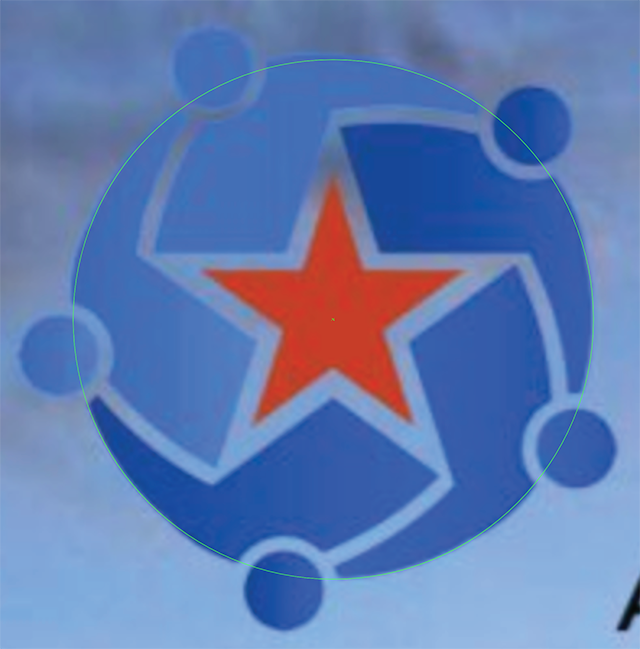
+
You'll note right away that the left shoulder projects slightly outside that
circle.

. Horizontal and vertical guides registered on the foci.
+

. A careful reconstruction of the star revealed an inner radius of
  \units[17,pt] and an outer radius of \units[44,pt]. However, when placed
  within circles of those radii, it becomes clear that it has been displaced
  upwards by roughly \units[2,pt].
+

. Circle guides for the ``star gutter,'' or the clear space around the central
  star (outer radius \units[64,pt] [⌀\units[128,pt]], inner
  radius \units[24,pt] [⌀\units[48,pt]]), plus circle guides of the same radii
  centered on the foci. This star, as well, appears to be displaced upward,
  though not as much as the central star---only \units[1,pt].
+
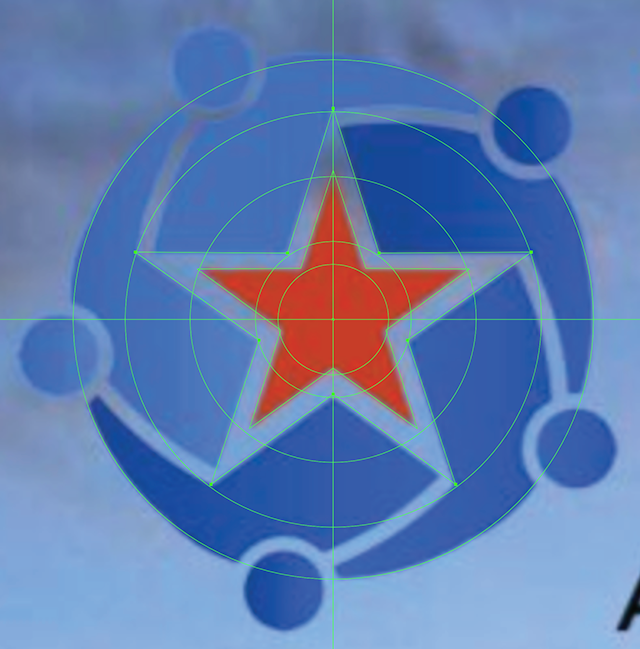
+
These displacements will complicate the gutters between the figures, which is
  unfortunate; each one will be subtly different from the other.

. Measured the angle between the center of the logo and the center of the dot
  at the upper right; this annoyingly turned out to be 44°. Then created five
  guides \units[100,pt] long separated at 72° angles (so 44°, 116°, 188°, 260°
  and{nbsp}332°), with the appropriate end of each located at the foci.
+

. Measured the heads; they're \units[25,pt] in diameter, with their centers set
  \units[86,pt] away from the center. Drew a sample head, and a circle of
  radius \unit[86,pt] centered at the loci.
+

. Because each of these is going to be different, and they're all defined by
  the gutters between the shapes, we also need to create gutters around the
  heads, and figure out how the gutters between the bodies is going to join
  between those and the tips of the stars. The head gutter is \units[33,pt] in
  diameter. I've also created a circle with \units[64,pt] radius displaced
  upwards by 1pt, an a concentric circle \units[59,pt] in radius to denote the
  inner edge of the body gutter there, and one at \units[61.5,pt] in radius to
  denote the centerpoint of that intersection. I've also created a
  \units[79,pt] radius circle to denote the end point of the body gutter, as
  well as an \units[81,pt] radius circle to locate that little shoulder
  ``hunch.''
+
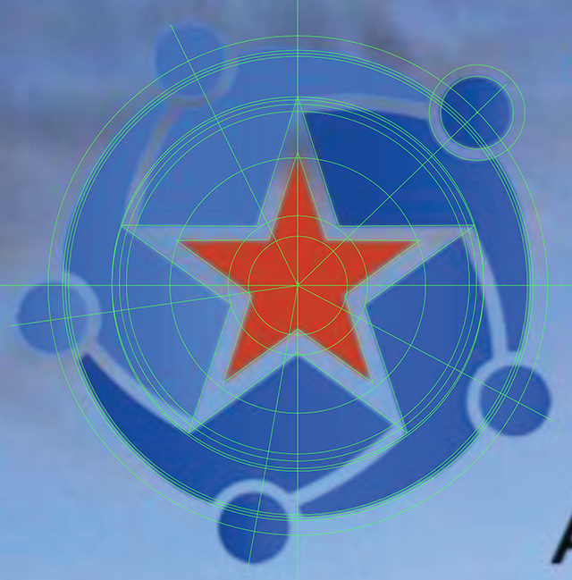

. Okay, we can start hiding some guides. We don't need the centered circles for
  the inner star or outer star at this point. However, we do need intersection
  lines for the star gutter, going from inner points to outer points. We'll
  also draw in a sample gutter link.
+

+
Unfortunately, that will be slightly different for every iteration.

=== The composite gutter

We need the head-gutters and the star gutter. Then we place the body gutters,
starting with the one we've already placed. We copy and paste this four more
times, rotating by 72° each time, and then carefully adjusting the end-anchors
of each one to by at the appropriate place. Each one is rendered as a line 5pt
wide.

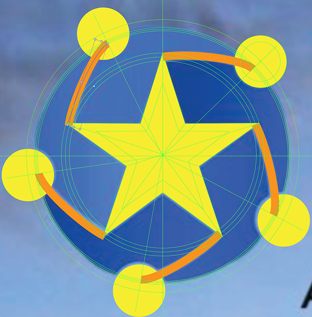

Then, one by one, we do the following:

[options="compact"]
* Select a body gutter.
* Convert the stroke to an outline.
* Move the point nearest the point of the star to precisely that point.

You have to do these one by one because the conversion of a stroke to an
outline gets a little screwy if you're doing more than one.

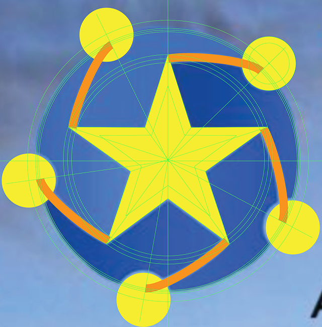

Now we can use Illustrator's Pathfinder tool to unify them into a single
shape.

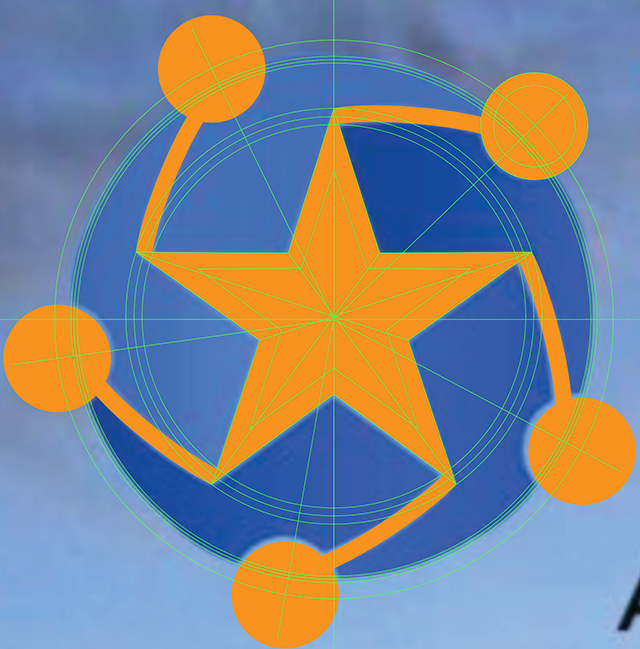

 That's what we'll use to ``cut'' the main body of the logo.

=== The main shape

This turns out not to be trivial. It's relatively symmetric, so it's much
better than it could be, but you need to define a single ``wedge'' of the
circle, then duplicate it, make it into one shape, and then you finally have
your base shape.

Start off with a circle of \units[80,pt] radius, centered at the foci.

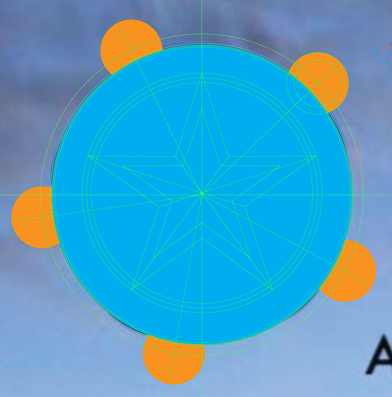

Now draw a chevron from the center, out to the centerpoints of two adjacent
``heads,'' making sure that the shape and the outside of the main circle do not
cross. The position of that point well outside the circle doesn't matter, just
as long as it keeps the edges from touching the main circle.

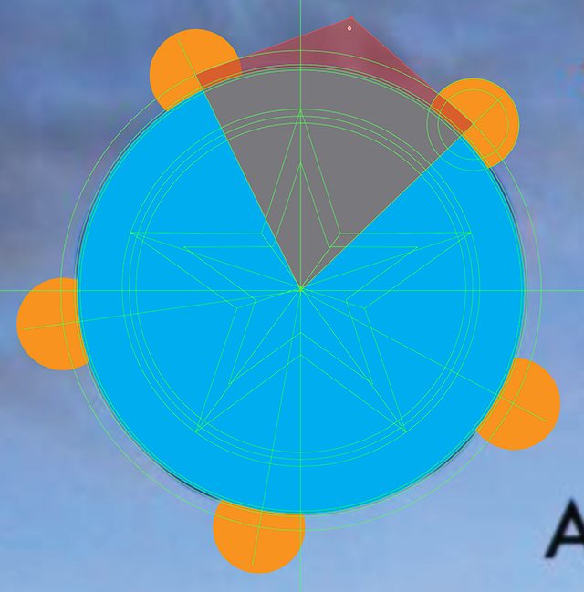

Now use Illustrator's Pathfinder function to create an intersection of the
shapes.

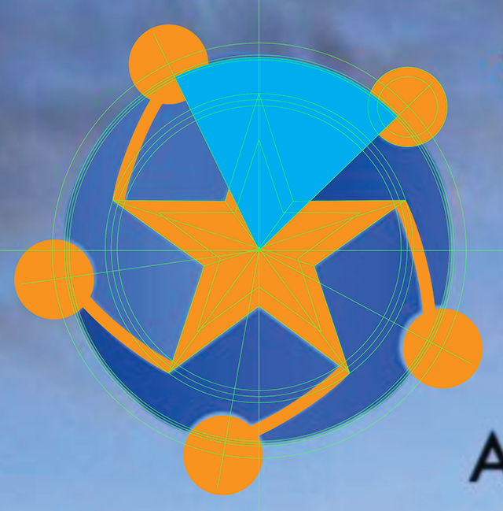

This shape is too complex due to the Pathfinder algorithm, so use ††Object ►
Path ► Simplify...†† to with a curve precision of{nbsp}75% and an angle
threshold of{nbsp}0° to reduce this to three points.

Then you can dd a point to the arc at where the shoulder is to be ``hunched,''
and move it up to the higher circle where it intersects with the head
gutter.

At that point, you can duplicate it four more times, rotating each
one{nbsp}72°, line up all the centerpoints, and then use Pathfinder's ``union''
function to make it all into a single shape.

Then, duplicate the main body layer and the composite gutter layer, use
Pathfinder Divide, ungroup the shapes, and trim out what isn't needed.

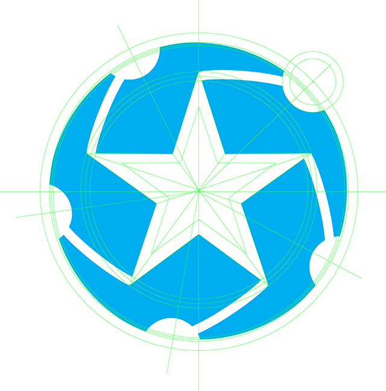

And that's how we get our five subtly different shapes.

Now use the gradient tool to color these appropriately. The problem here is
that the original designer actually made the gradients straight across (0°). In
order to make these ``symmpetric,'' The gradient angles should be roughly 24°
at the topmost body, then working clockwise, {minus}48°, {minus}120°, 168°, and
96°. That said, we'll follow the original design and set these all to{nbsp}0°.

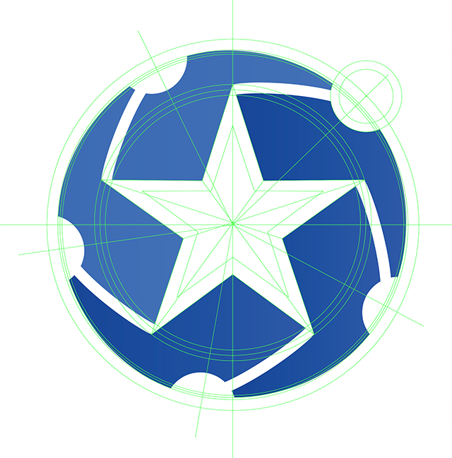

Now it's just a matter of setting the ``heads'' (which use the same gradients
as their corresponding ``bodies'') and putting the central star where it needs
to be.

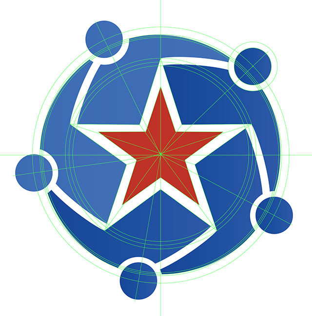

=== The text

The Futura Medium text is set at \units[30,pt], with a \units[34,pt] leading,
and a tracking value of +100. The center of the box is positioned at
\units[343,pt] to the right of the origin, and the top of the box is
\units[39,pt] below the origin.

The ``VA-PALS'' bit is a lot wonkier. It's set at \units[144,pt], but it's
stretched horizonally by{nbsp}110%, the ``VA'' is tracked at{nbsp}{minus}175,
the ``A-'' is tracked at{nbsp}{minus}125, but the hyphen is raised by
\units[16,pt], the ``-P'' is tracked at{nbsp}{minus}50, the ``PA'' is tracked
at{nbsp}{minus}175, the ``AL'' is tracked at{nbsp}{minus}150, and the ``LS'' is
tracked at {nbsp}{minus}75. Coloration matches the scheme above (at the dark
parts of the gradients). It's centered at \units[348,pt] from the right of the
origin, and the top of the box is at \units[24,pt] above the origin.

