:doctitle:    VA-PALS – Projects – Vista Expertise Network
:mastimg:     aboutvista
:mastcaption: Vista consultants
:mastdesc:    Real-time patient information means real care

== I-ELCAP Study Coordinator Program (2013)--- Slideshow

This accompanied a talk presented in 2013; I don't know anything else about the
presentation. (link:sec-1-sc-training-2013-updated.pptx[Download the original
PowerPoint file], if you must.)

Notes accompany a few of the slides; they'll be noted in an
††alternative font††.

According to Rick, Claudia Henschke says ``additions, changes, suggestions,
critiques are welcome.''

++++++

[[s01]]
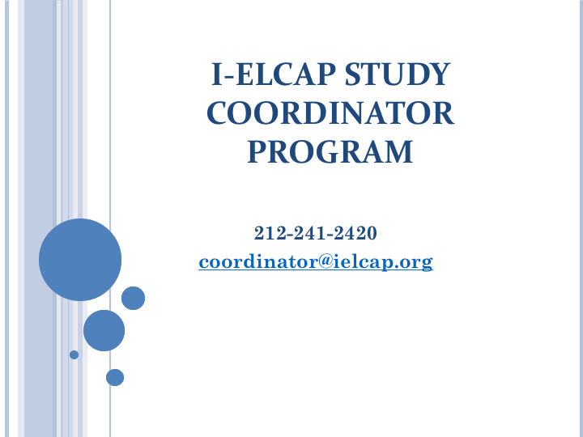

††Welcome everyone.  Coffee and bagels will be set up in the
conference room.  Introduce Dr. Henschke and get her set up to discuss
the results of the original ELCAP. (ask Dr. H for slides with the
results on them)††

[[s02]]
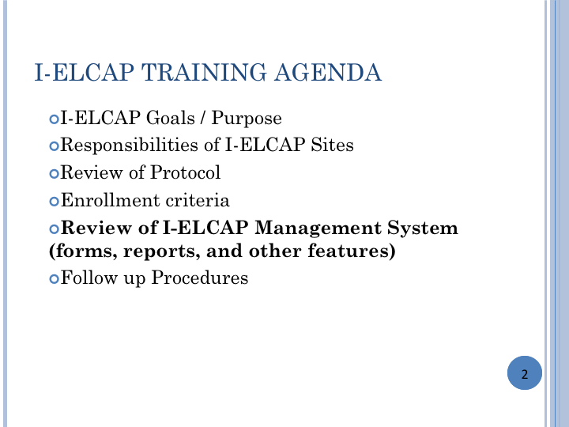

[[s03]]
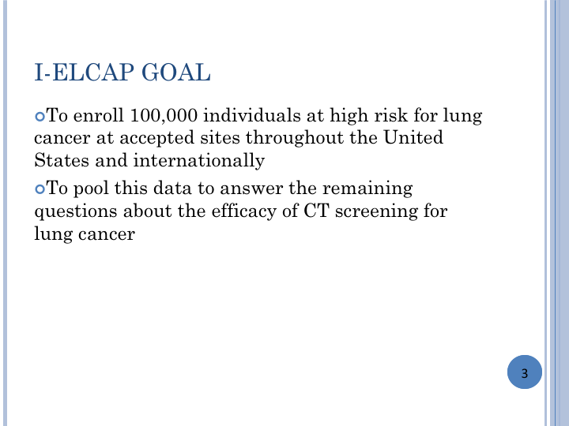

[[s04]]
image::slide04.png[link="larger/slide04.png"]

††*correspond= by message board, email or phone calls††

[[s05]]
image::slide05.png[link="larger/slide05.png"]

[[s06]]
image::slide06.png[link="larger/slide06.png"]

[[s07]]
image::slide07.png[link="larger/slide07.png"]

††Show pictures of one of each type of nodule.††

[[s08]]
image::slide08.png[link="larger/slide08.png"]

[[s09]]
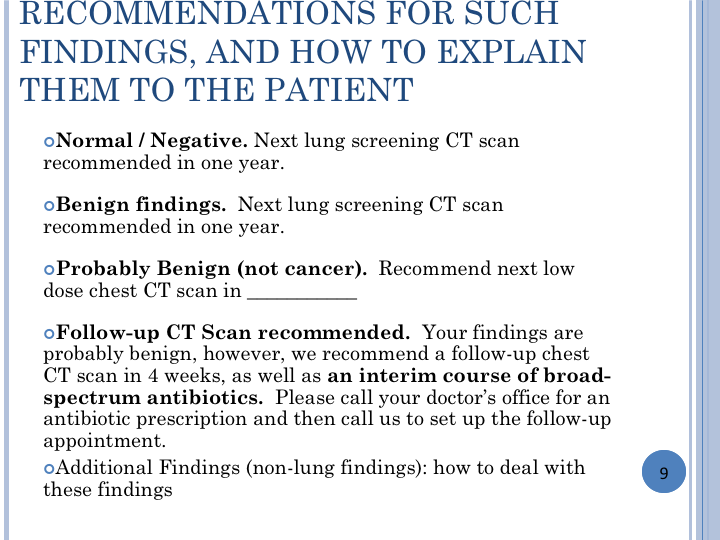

[role="altfont"]
--
Hand out a copy of the letter to send to the patients and tell them that we send this to the patients with the report. +
**Normal / Negative.**   No evidence of early lung cancer.  Recommend next screening CT scan in one year. +
**Benign findings.**  Next lung screening CT scan recommended in one year. * +
**Probably Benign (not cancer).**  Recommend repeat screening chest CT scan in 6 months. * +
{qquad}Please call us for an appointment __phone number here__. +
**Probably Benign (not cancer).**  Recommend follow-up diagnostic chest CT scan in 6 months. * +
{qquad}Please call us for an appointment __phone number here__. +
**Probably Benign (not cancer).**  Recommend course of broad-spectrum antibiotics and follow-up diagnostic CT scan in 8 weeks.  * +
Please call your doctor’s office for antibiotic prescription and then call us to set up the follow-up appointment phone number here. +
Additional CT imaging studies are needed to complete evaluation.  Please understand that the majority of persons requiring further evaluation with interval CT scans are found to have benign (not cancer) abnormalities. +
{qquad}Please call us for an appointment at __phone number here__. +
**Previous films needed.**  There is a finding on your lung screening CT scan that needs to be compared to previous CT scans or chest x-rays you may have had.  You can request your original films from the facility where you had them done.  You will need to sign a release to obtain these records. +
** Abnormal.**  There is a finding on your lung screening CT scan that requires further tests for a more thorough evaluation.  You should contact your physician or health care provider as soon as possible (if you have not already done so).
--

[[s10]]
image::slide10.png[link="larger/slide10.png"]

[[s11]]
image::slide11.png[link="larger/slide11.png"]

Rick: “Here's one for Linda's list of draft-two issues: [...], "Each site is
assigned a two letter code for their site to be used for study id assignments."

“At the kickoff meeting in Phoenix, Claudia suggested that for VA this might be
"VA," but that's not going to fly, since most VA sites have their own Vista
system with their own copy of the SAMI software.

“VA facilities have conventional three-letter unique codes to distinguish them,
like PHX for Phoenix, HOU for Houston, or PUG for VA Puget Sound. I'll have to
scare up a reference table of these, since they're not listed in the
Institution or Facility files. They may not always be three letters any more,
either, after the various mergers, so I don't know whether this will work, but
it might.

“Anyway, within VA a code like PHX or HOU would probably work as its code. If
Mt. Sinai needs to refer to these sites, though, it should probably be prefixed
with VA, like VAPHX or VA-PHX.

“We can sort all that out for draft two, but it will need to get pinned down
then, because the Study IDs are formed by assigning a unique number after the
prefix, like TM0927.

“Also, Claudia agrees that VA will need a longer number after the site code
than IELCAP has been using, since we have so many patients, so we might be
looking at something like PHX-000-000-0001 inside VA, and VA-PHX-000-000-0001
if we were sharing that study ID with Mt. Sinai.”

Kathy: “Maybe we could do a two-letter code that is V for VA, followed by a
single letter denoting the site. So VP for Phoenix and VH for Houston.”

Rick: “But there will be 127 systems, and there are only 26 letters. Oh, you
meant for draft one. Gotcha.”

Kathy: “Yes. I assume we'll be changing the whole thing eventually. :)”

[[s12]]
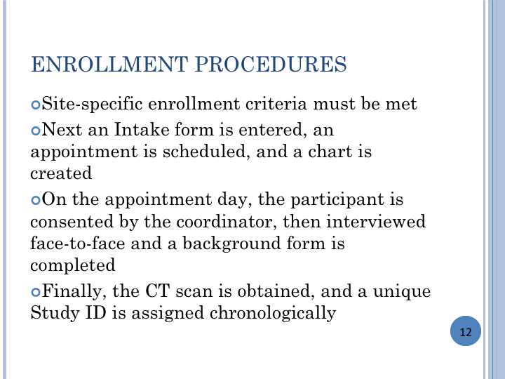

Linda: “I'm wondering if VA already has a process for printing out a consent
form or if they fill out a boilerplate template by hand like they still do at
most of the places I've had to fill out consent forms. Is this something that
should be in the VA ELCAP package?”

Kathy: “They probably need a separate consent for the study.”

[[s13]]
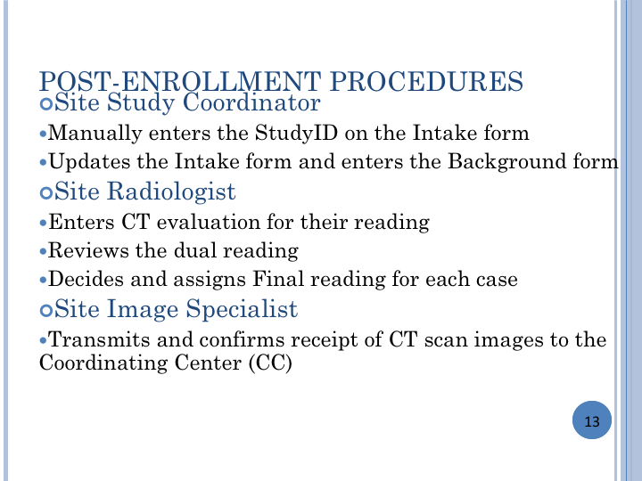

††Hand out the ny-elcap flow chart – report notification††

Linda: “Is someone coming up with sort of a checklist of steps? I notice [here]
the coordinator has to enter the Study ID manually in the Intake Form after
filling out the Background Form. This should be something that the system can
do for them.”

Rick: “I think with this slide deck, for the first time we have close to enough
info to create a checklist and flow chart of the steps.”

Kathy: “Eventually, we'll be able to pre-fill some of the forms, but I think
the plan for now is to approximate their process as closely as we can.”

[[s14]]
image::slide14.png[link="larger/slide14.png"]

[[s15]]
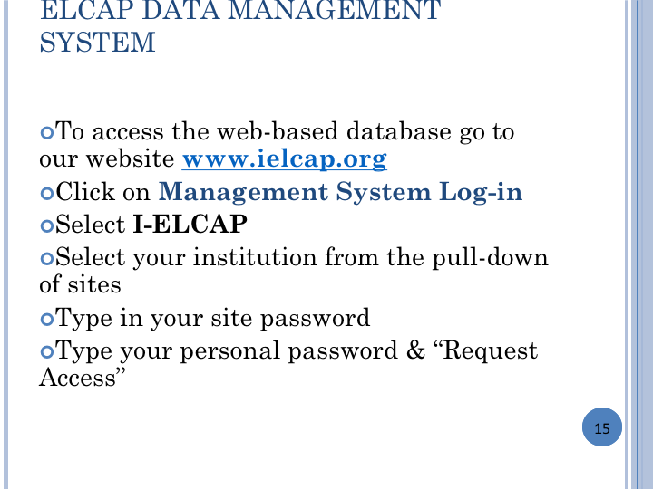

††Have them do this as you describe it.††

[[s16]]
image::slide16.png[link="larger/slide16.png"]

[[s17]]
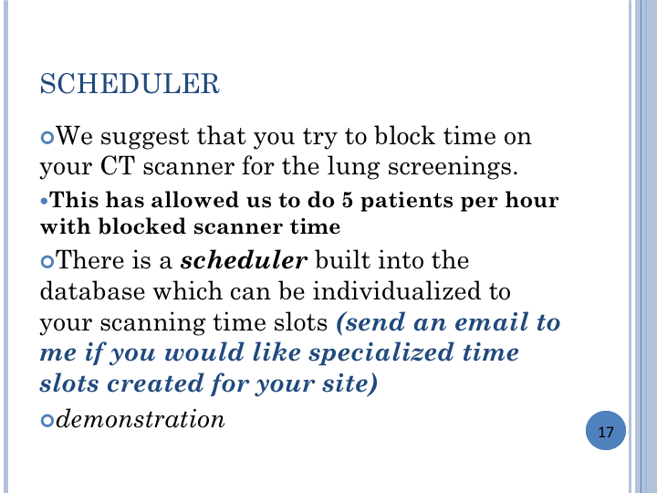

[[s18]]
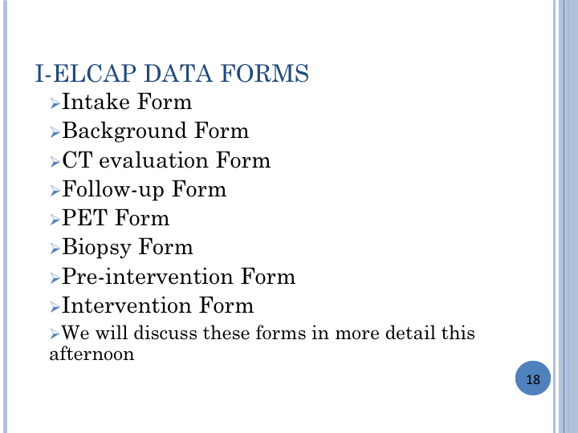

[[s19]]
image::slide19.png[link="larger/slide19.png"]

††Have them go to this section as it is discussed††

[[s20]]
image::slide20.png[link="larger/slide20.png"]

Rick: “This brings into focus a question I had, namely how one gets into these
forms in the first place. There must be some opening sign-in screen to the
application that contains this "New Case" button and maybe others. I believe I
saw it in passing at the Phoenix kickoff meeting, but I do not remember it
clearly, and I have no reference image captured of it. I think we're going to
need to see that to help organize an information flow in SAMI that matches
IELCAP closely.

“I'll ask Claudia and Artit about it.”

[[s21]]
image::slide21.png[link="larger/slide21.png"]

[[s22]]
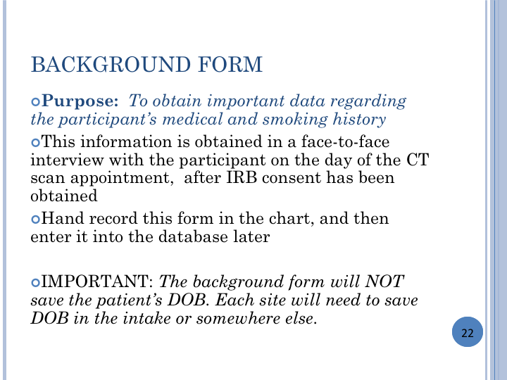

[[s23]]
image::slide23.png[link="larger/slide23.png"]

[[s24]]
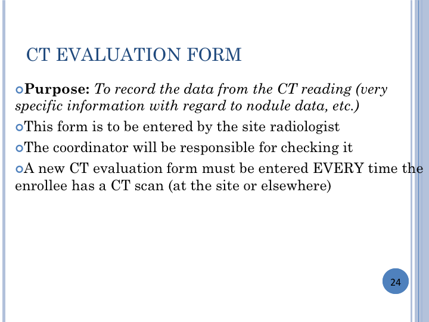

[[s25]]
image::slide25.png[link="larger/slide25.png"]

[[s26]]
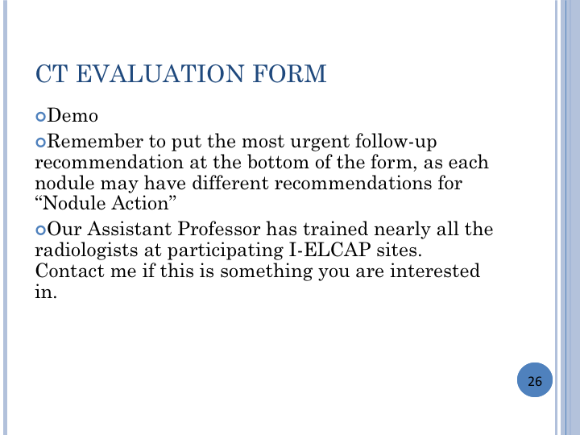

[[s27]]
image::slide27.png[link="larger/slide27.png"]

††Many reasons for Center read to be behind- server, business at Center,
turnaround time generally 48 hours. Special requests can always be sent.††

[[s28]]
image::slide28.png[link="larger/slide28.png"]

[[s29]]
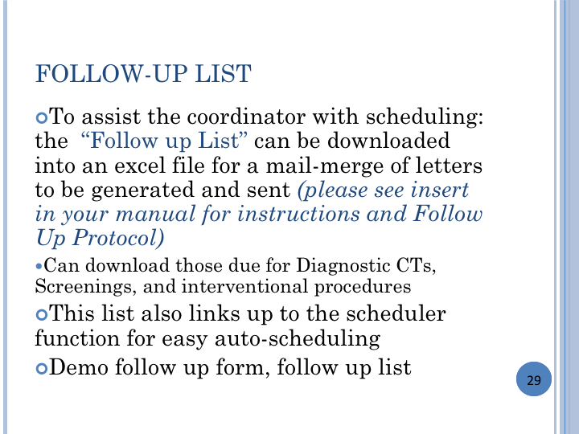

[[s30]]
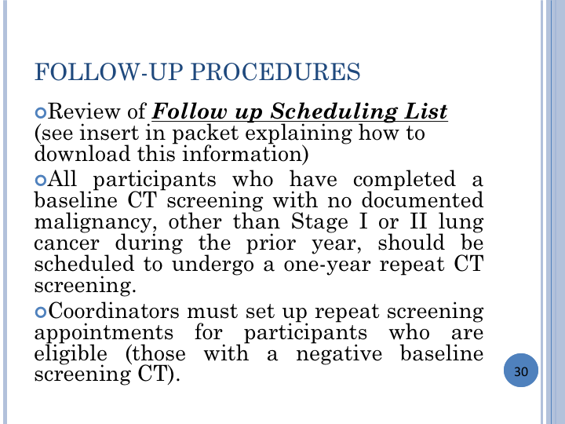

[[s31]]
image::slide31.png[link="larger/slide31.png"]

[[s32]]
image::slide32.png[link="larger/slide32.png"]

[[s33]]
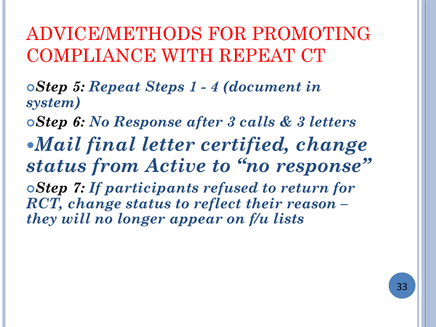

[[s34]]
image::slide34.png[link="larger/slide34.png"]

[[s35]]
image::slide35.png[link="larger/slide35.png"]

[[s36]]
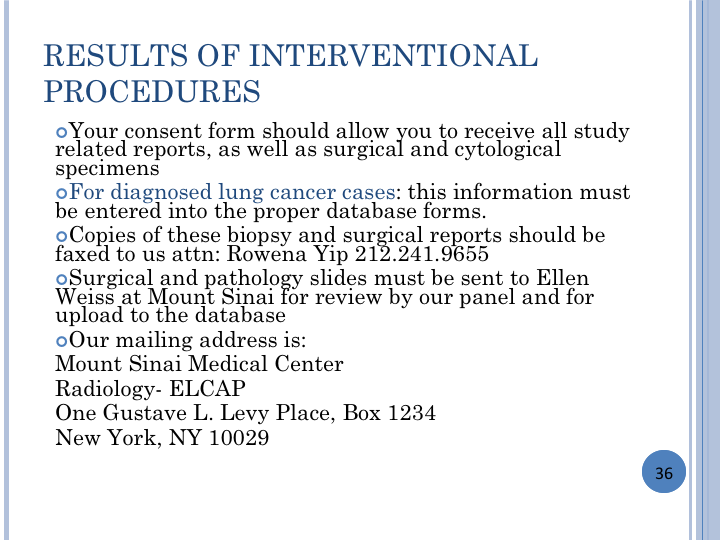

[[s37]]
image::slide37.png[link="larger/slide37.png"]

[[s38]]
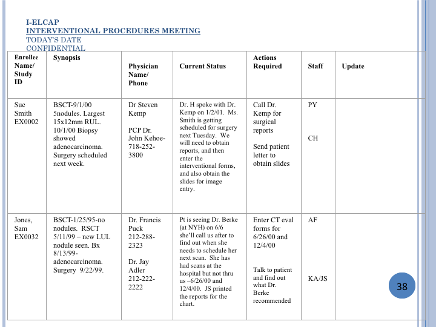

[[s39]]
image::slide39.png[link="larger/slide39.png"]

††Any new cases must be sent to Rowena.††

Rick: “<<s22,Slide 22>>, Background Form, refers to "after IRB consent has been obtained."

“<<s36,Slide 36>>, Results of Interventional Procedures, reads "your consent
form should allow you to receive all study related reports, as well as surgical
and cytological specimens."

“I think these and <<s12,slide 12>> are all referring to the same thing, some
kind of consent form. I agree we'll want to study how VA does it now when we
integrate this into Vista, but I'd like to start by emulating the IELCAP
software as closely as possible, so I'll reach out to Claudia and Artit about
getting a copy of this Consent Form.”

[[s40]]
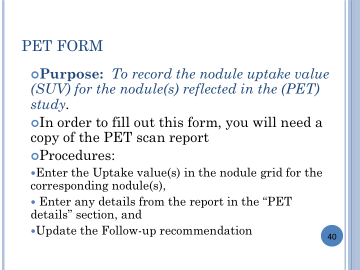

[[s41]]
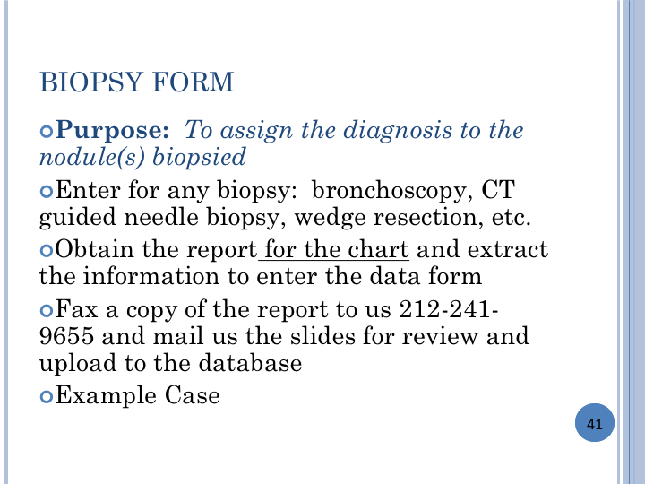

[[s42]]
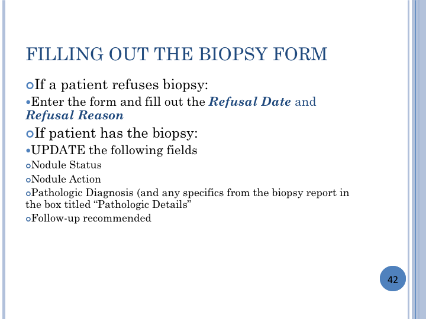

[[s43]]
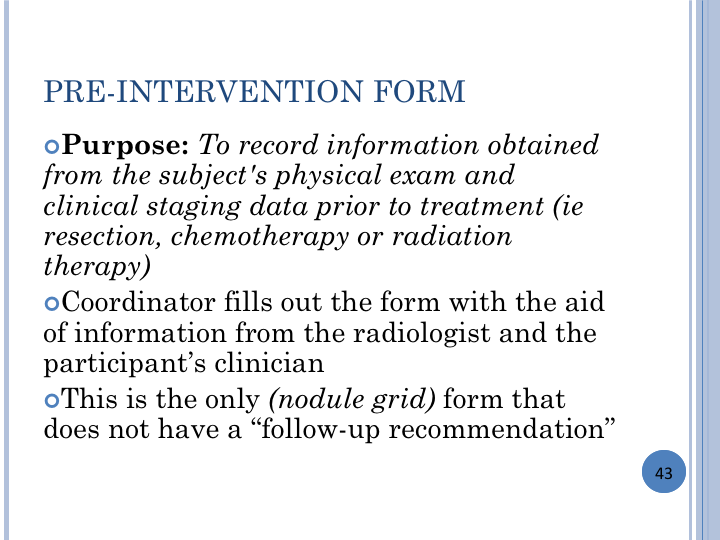

[[s44]]
image::slide44.png[link="larger/slide44.png"]

[[s45]]
image::slide45.png[link="larger/slide45.png"]

[[s46]]
image::slide46.png[link="larger/slide46.png"]

[[s47]]
image::slide47.png[link="larger/slide47.png"]

[[s48]]
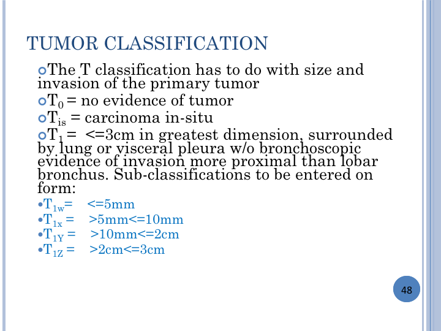

[[s49]]
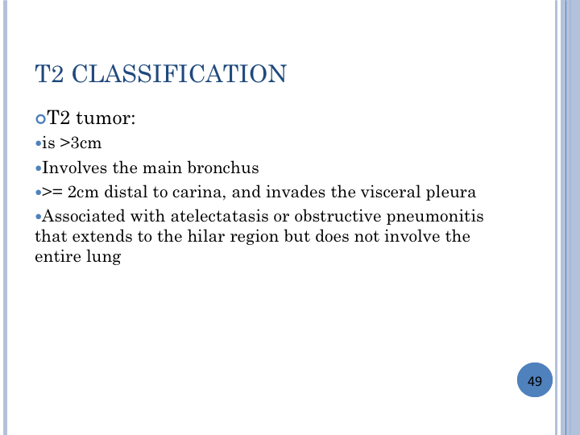

[[s50]]
image::slide50.png[link="larger/slide50.png"]

[[s51]]
image::slide51.png[link="larger/slide51.png"]

[[s52]]
image::slide52.png[link="larger/slide52.png"]

[[s53]]
image::slide53.png[link="larger/slide53.png"]

[[s54]]
image::slide54.png[link="larger/slide54.png"]

[[s55]]
image::slide55.png[link="larger/slide55.png"]

[[s56]]
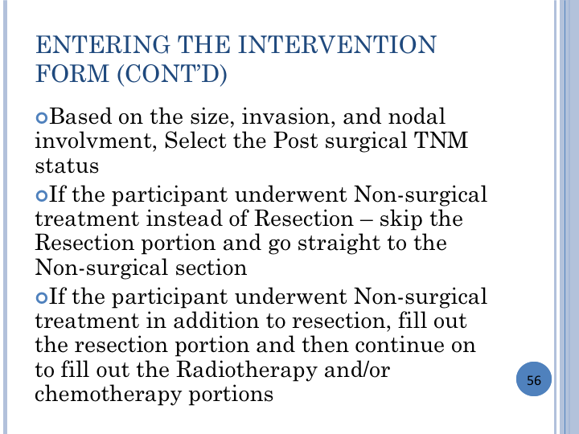

[[s57]]
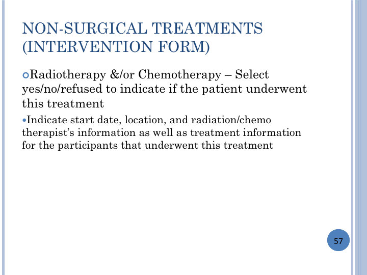

[[s58]]
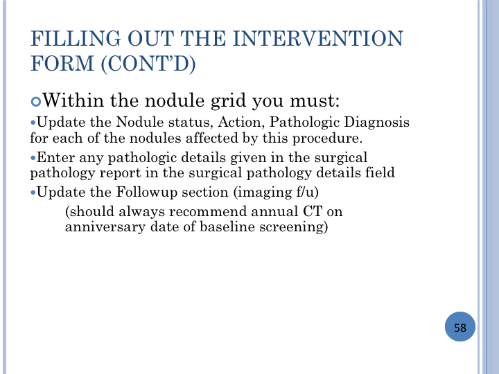

[[s59]]
image::slide59.png[link="larger/slide59.png"]

[[s60]]
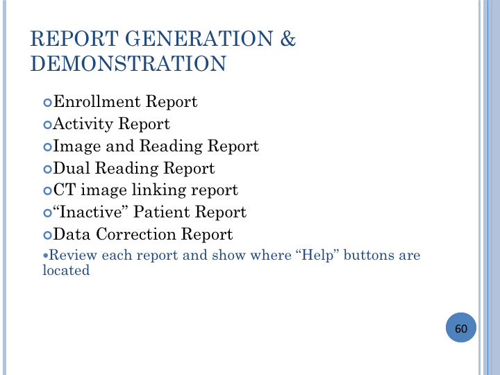

[[s61]]
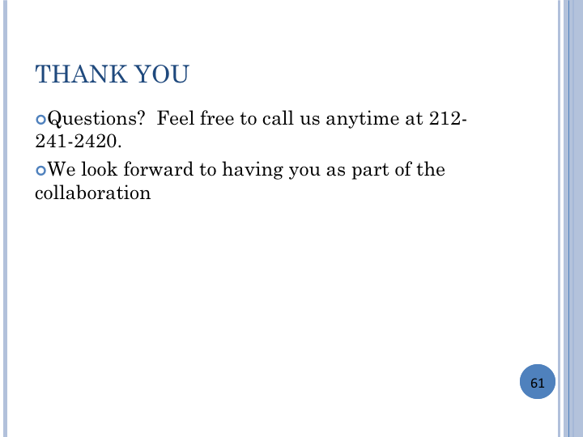

