:doctitle:    VA-PALS Management System – VA-PALS – Projects – Vista Expertise Network

== A VistA Class I National Lung Cancer Screening Management System

This was presented by Ricardo Avila at the VA-PALS Lung Screening Summit on
January{nbsp}25,{nbsp}2018.

++++++

[[01]]
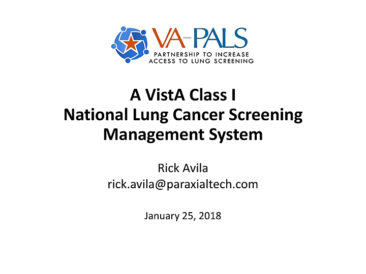

[[02]]
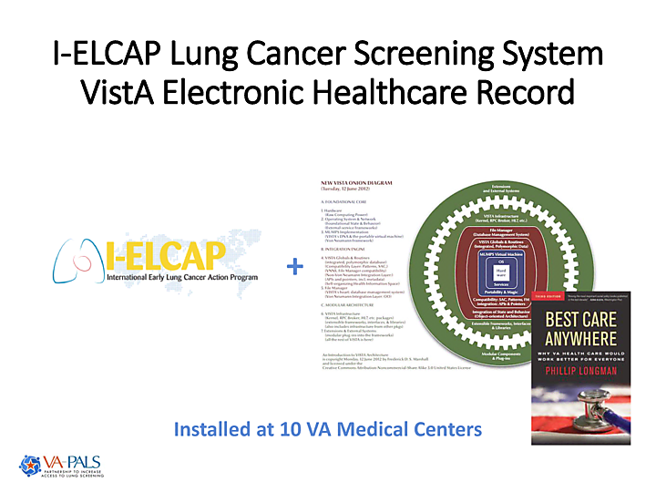

[[03]]
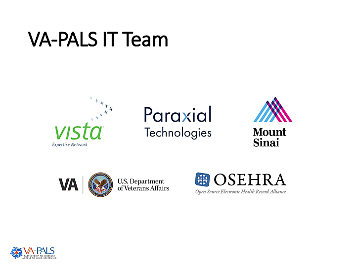

[[04]]
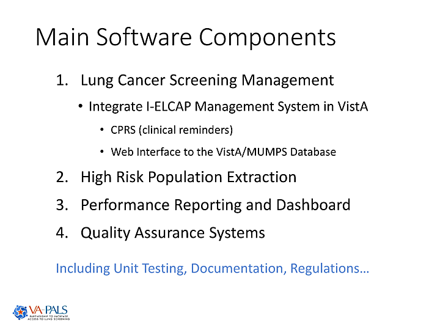

[[05]]
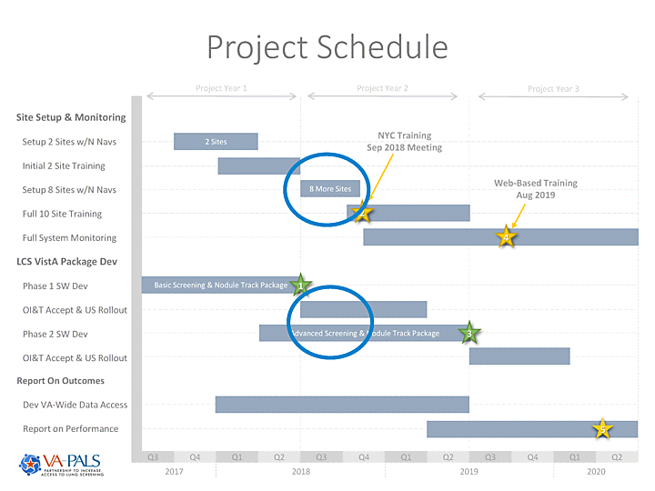

[[06]]
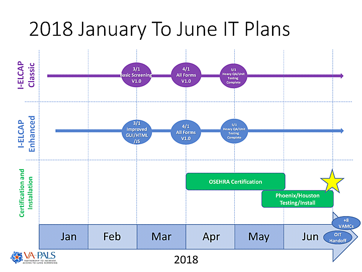

[[07]]
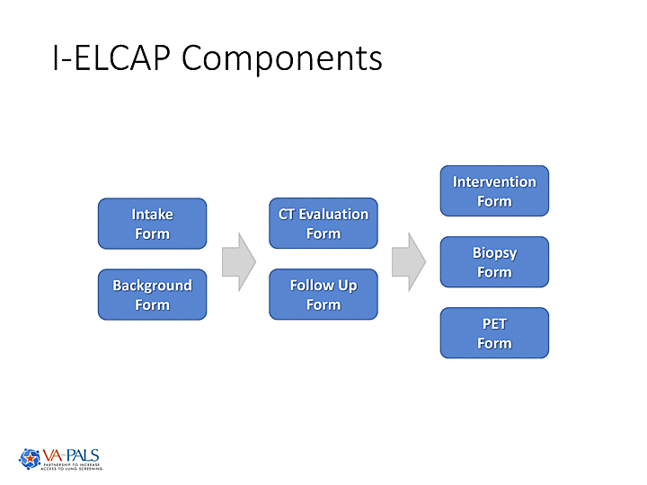

[[08]]
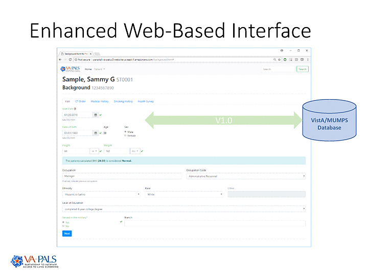

[[09]]
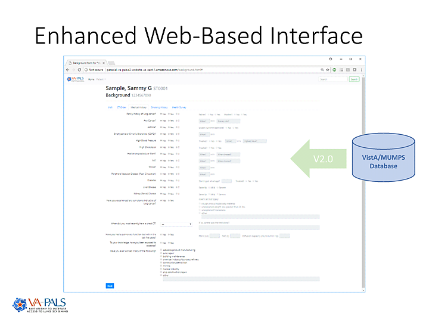

[[10]]
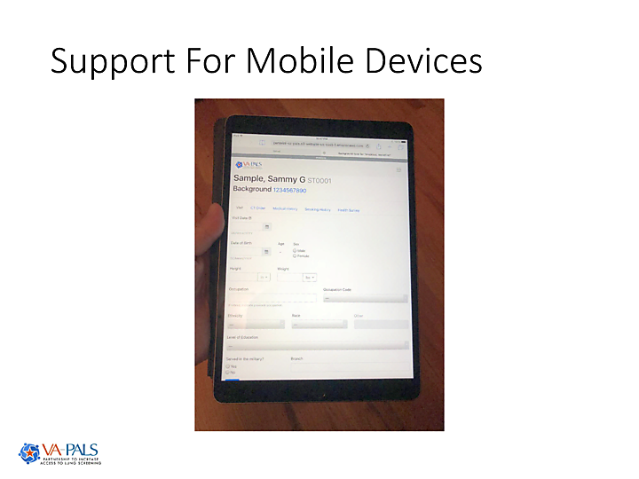

[[11]]
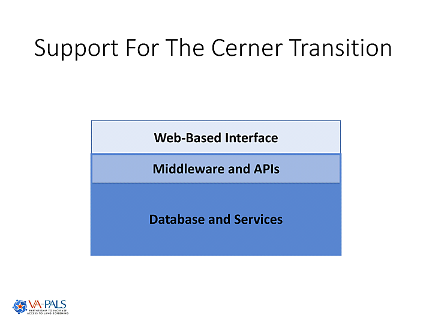

[[12]]
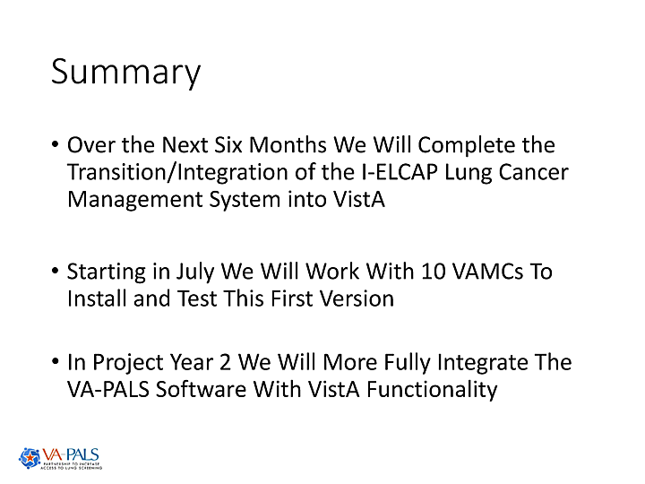

[[13]]

[[14]]
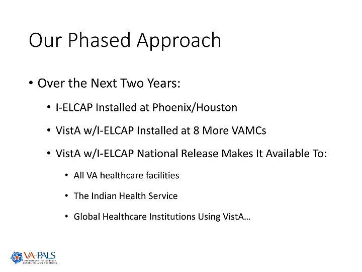

