:doctitle:    I-ELCAP process slideshow – {crumbtrail}

== VA-PALS --- Slideshow

This accompanied a talk presented on 2017-07-18 by Artit Jirapatnakil and
Claudia Henschke. The additional text below is taken from Rick's
notes. (link:ch-aj-talk-2017-07-18.pptx[Download the original PowerPoint file],
if you must.)

The attendees were:

[options="compact"]
* Claudia Henschke, radiologist; narrated and explained
* Artit Jirapatnakil, [role missed]; presented the deck
* George Lilly, Vista engineer
* Felicia [last name missed], coordinator/navigator
* Mike [last name missed], coordinator/navigator
* Angel Williams, coordinator/navigator
* Rowena Yip, [role missed] [She's a doctor and researcher.]
* Shawna Adler, [role missed]
* Dan Max, I-ELCAP programmer
* [name missed], admin director & [role missed] for VA-PALS
* Linda Yaw, everything
* Kathy Ice, documenter & tester
* Rick Avila, [he's interviewing for 2 people to join]
* Rick Marshall, heh
* David Yankelevitz, [role not mentioned]

++++++

[[01]]
image::slide01.png[link="larger/slide01.png"]

[[02]]
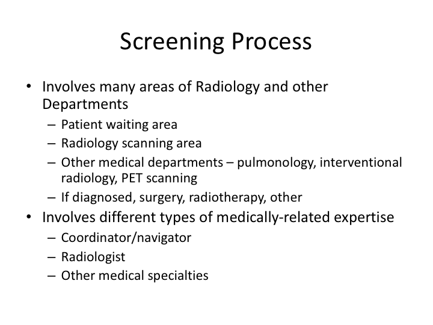

[[03]]
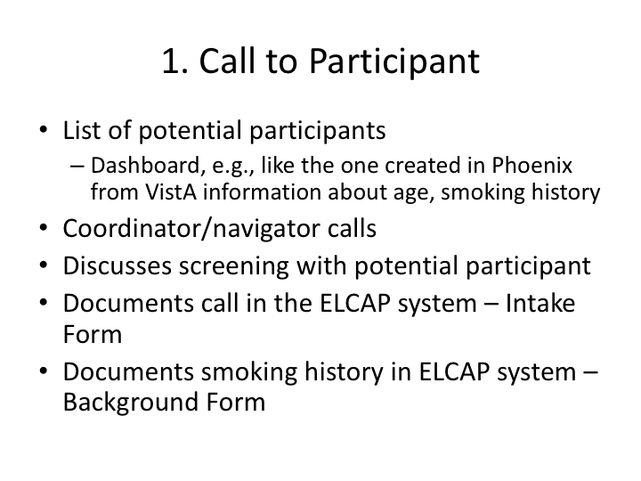

This includes putting out ads to get people to call. The Dashboard at VA
Phoenix will be collecting all the information. It's currently hard to sort out
who has been diagnosed or note, and the patient's smoking history is hard to
get.

The intake and background forms document it all.

[[04]]
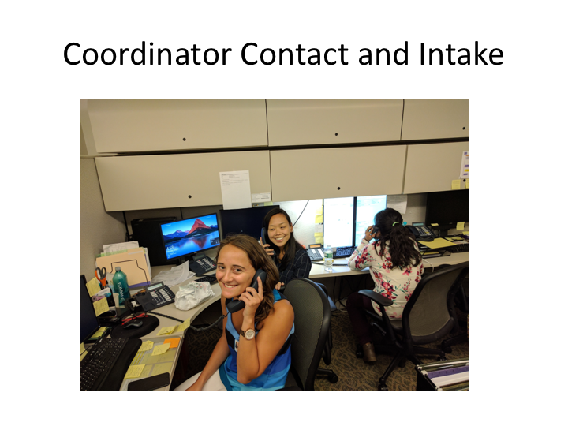

[[05]]
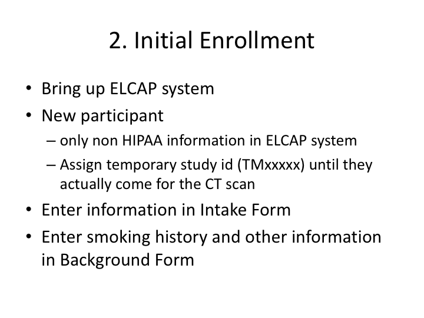

Every site puts HIPAA information in a different system; only non-HIPAA stuff
goes into I-ELCAP.

The temporary study ID is replaced with a regular study ID when they get their
CT scan.

Also, a note that says ``transitioned from research database to a more nimble
system,'' whatever that means.

[[06]]
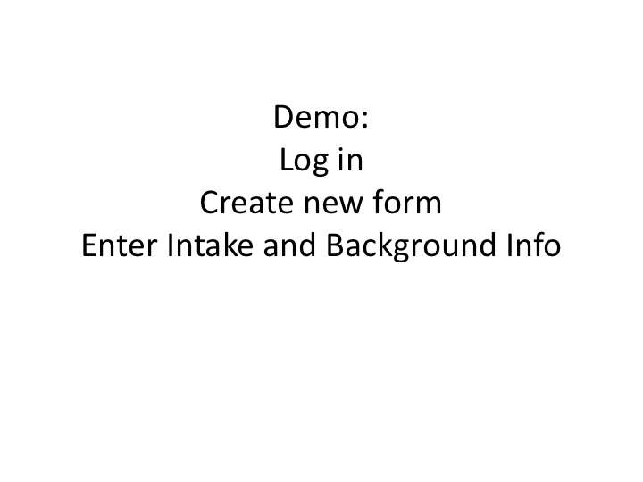

[[07]]
image::slide07.png[link="larger/slide07.png"]

[[08]]
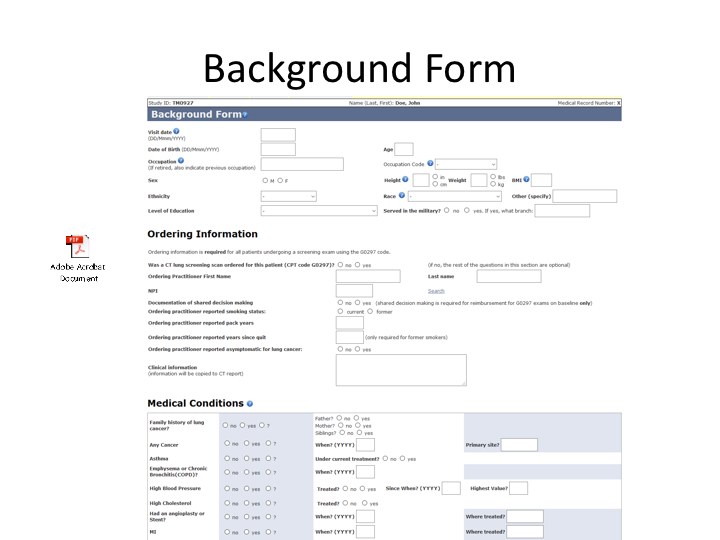

[[09]]
image::slide09.png[link="larger/slide09.png"]

[[10]]
image::slide10.png[link="larger/slide10.png"]

[[11]]

[[12]]
image::slide12.png[link="larger/slide12.png"]

[[13]]
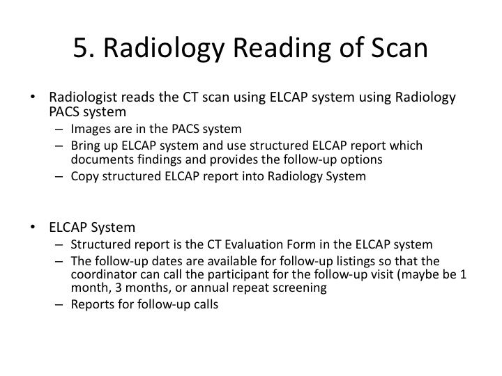

[[14]]
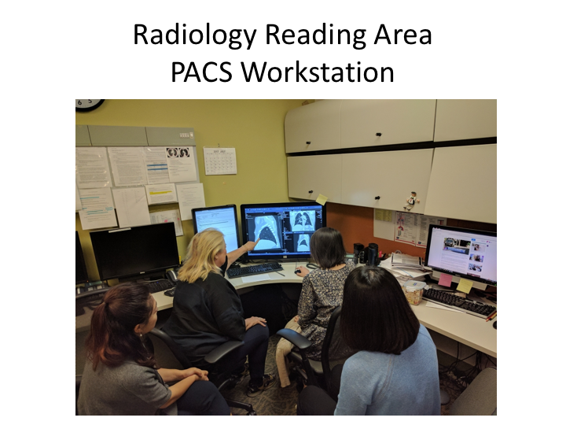

[[15]]
image::slide15.png[link="larger/slide15.png"]

[[16]]
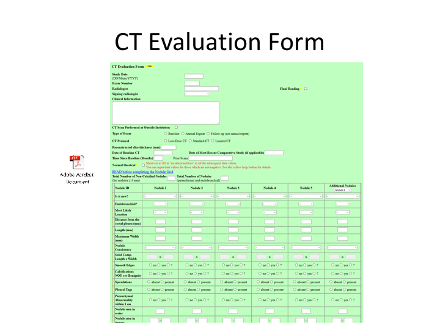

[[17]]
image::slide17.png[link="larger/slide17.png"]

[[18]]
image::slide18.png[link="larger/slide18.png"]

[[19]]
image::slide19.png[link="larger/slide19.png"]

[[20]]
image::slide20.png[link="larger/slide20.png"]

[[21]]
image::slide21.png[link="larger/slide21.png"]

[[22]]
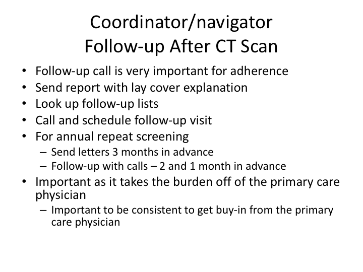

[[23]]
image::slide23.png[link="larger/slide23.png"]

[[24]]
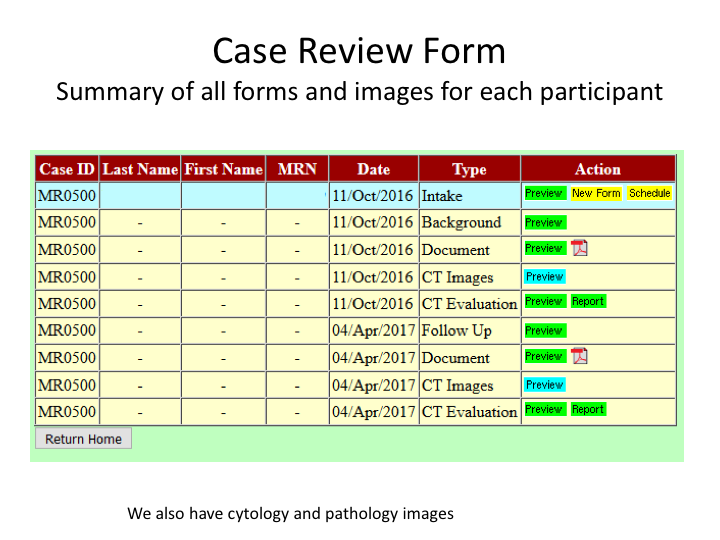

[[25]]
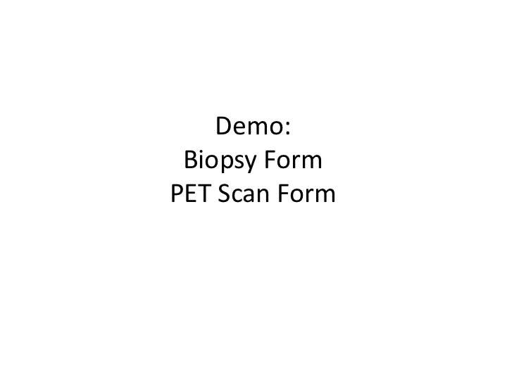

[[26]]
image::slide26.png[link="larger/slide26.png"]

[[27]]
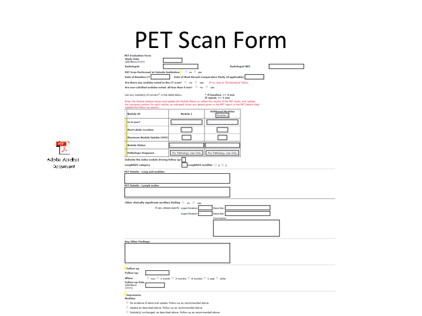

[[28]]
image::slide28.png[link="larger/slide28.png"]

[[29]]
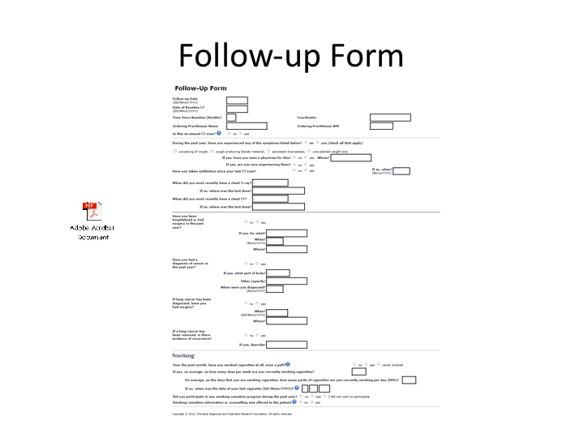

[[30]]
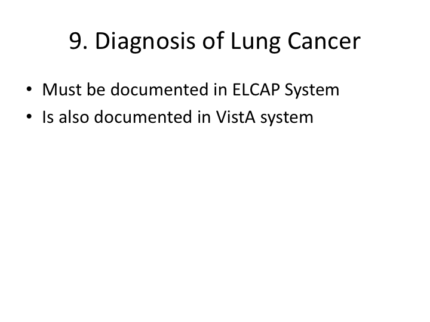

[[31]]
image::slide31.png[link="larger/slide31.png"]

[[32]]
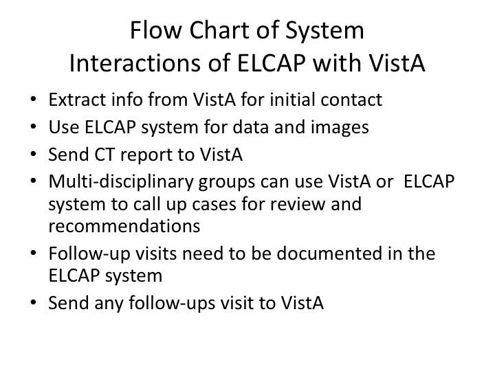

[[33]]
image::slide33.png[link="larger/slide33.png"]

[[34]]
image::slide34.png[link="larger/slide34.png"]

[[35]]
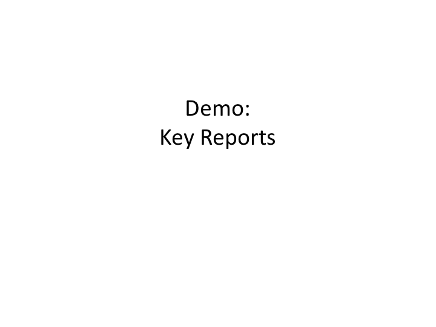

[[36]]
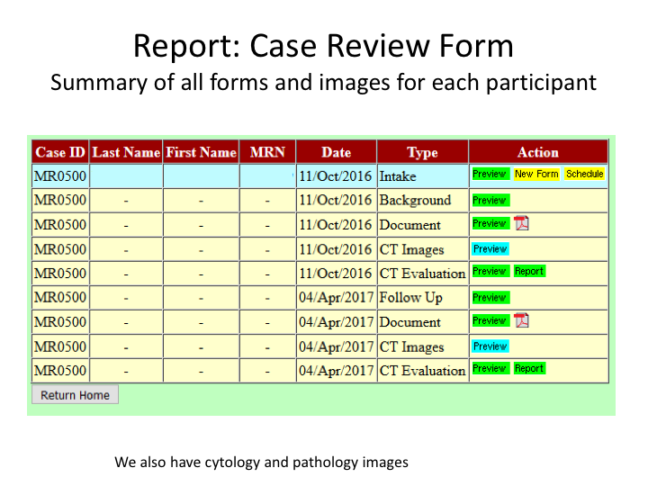

[[37]]
image::slide37.png[link="larger/slide37.png"]

[[38]]
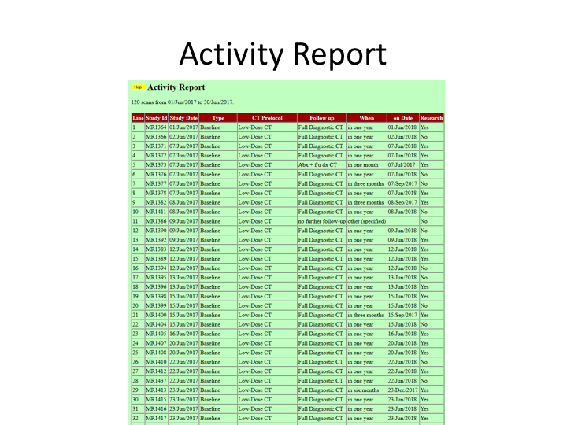

[[39]]
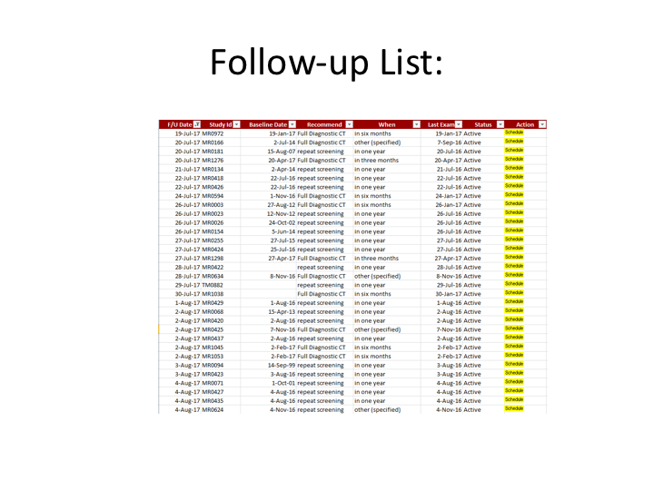

