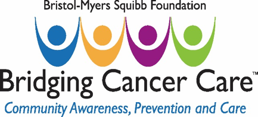

:doctitle:    PALS – Projects – Vista Expertise Network
:linkcss:
:mastimg:     aboutvista
:mastcaption: Vista consultants
:mastdesc:    Real-time patient information means real care
:navlight:    vista
:disable-javascript:

== This document

Via Rick: ``Here's the final draft proposal for the VA-PALS project, the one
that won the grant award. Although the VA-PALS official start date is likely to
be 1{nbsp}July, I'd like to take advantage of the time ahead of that start date
to bring us all (including me) up to speed so we can hit the ground running. We
have a lot to learn, but the first step is obvious: assessing what we agree to
do for this grant money.''

The original file was a Word document named ††VA-PALS BMSF Proposal 2017.docx††
(link:va-pals-bmsf-proposal-2017.docx[download]).

'''

[role="center"]

+++

+++

[cols="<.<0a,<.<1a",width="99%",frame="all",align="center",grid="none"]
|==============================================================================
|**Date of submission:** (MMDDYYYY): |4/13/2017
2+|**ORGANIZATION AND CONTACT INFORMATION:**
|[nowrap]##**Organization Name:**##
|McGuire Research Institute, Inc.
|[nowrap]##**Organization Website:**##
|http://www.navref.org/mcguire-research-institute/[]
|**Mailing Address:**
|VA Medical Center +
1201 Broad Rock Blvd +
Richmond, VA{quad}23249
|**Executive Director/CEO:**
|Robert Dresch {langbr}mailto:drew.moghanaki@va.gov[]{rangbr}
|[nowrap]##**Name & Title of Contract Signatory:**## +
(if different from ED)
|{zwj}[n/a]
|[nowrap]##**Name & Title of Primary Contact Person for this project:**##
|Drew Moghanaki, MD, MPH, Principal Investigator +
[nowrap]##**Phone:**{nbsp}804-675-5105##{quad}[nowrap]##**E-mail:** mailto:drew.moghanaki@va.gov[]##
2+|
2+|**PROJECT INFORMATION:**
|**Title:**
|Veterans Affairs---Early Lung Cancer Action Program (VA-ELCAP)
|**Name and Title of Project Principal investigator:**
|Drew Moghanaki, MD, MPH, Director of Clinical Radiation Oncology Research,
Hunter Holmes McGuire VA Medical Center, Associate Professor, Virginia
Commonwealth University Department of Radiation Oncology +
[nowrap]##**Phone:**{nbsp}804-675-5105##{quad}[nowrap]##**E-mail:** mailto:drew.moghanaki@va.gov[]##
|==============================================================================

